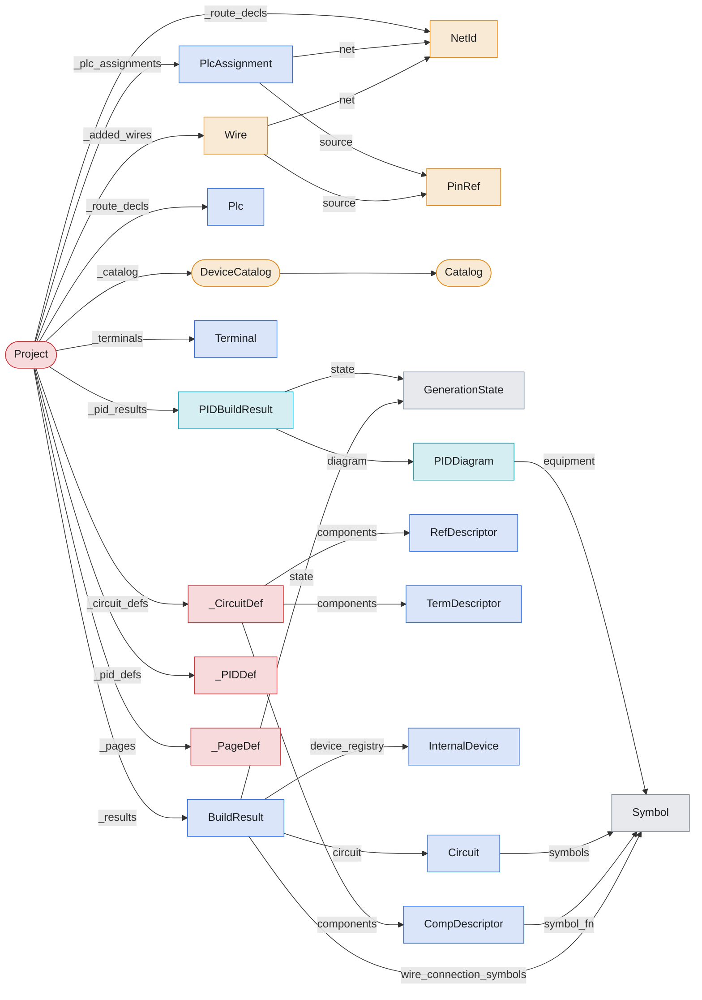
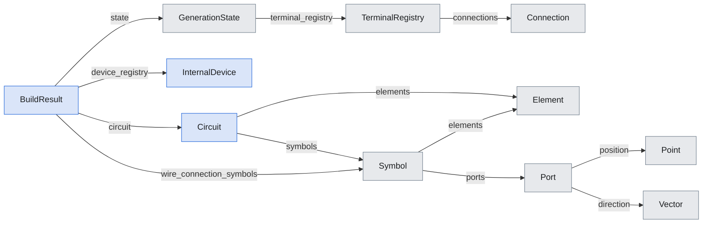
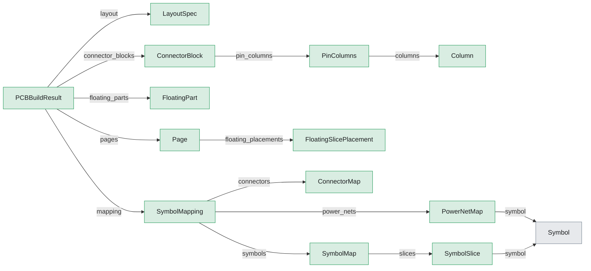
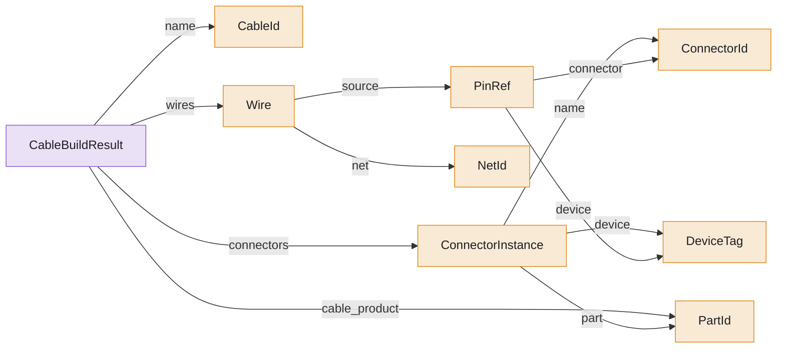

# Anatomy

> Generated by `scripts/type_graph.py` from the live code. Do not edit; regenerate with `just type-graph`.

Each diagram starts at one type and follows `field`, `holds` and `inherits` edges down to a fixed depth: what the type contains, recursively. Edge labels are field or attribute names. Hubs (builders, `Project`) are stadium-shaped.

## `Project`

22 types within depth 2 of `project.Project`.

## `BuildResult`

11 types within depth 3 of `electrical.builder_models.BuildResult`.

## `PCBBuildResult`

14 types within depth 3 of `pcb.model.PCBBuildResult`.

## `CableBuildResult`

9 types within depth 3 of `cable.result.CableBuildResult`.

