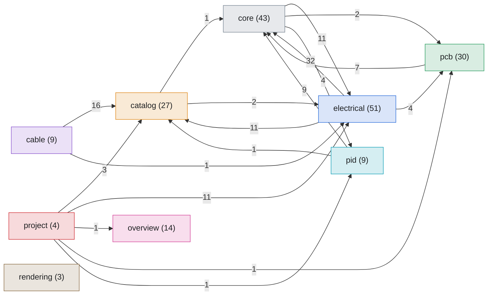

# Schematika data model

> Generated by `scripts/type_graph.py` from the live code. Do not edit; regenerate with `just type-graph`.

190 types (166 dataclasses: 149 frozen, 17 mutable; 9 builder/registry/`Project` classes; 8 ID scalars; 4 enums; 2 protocols; 1 namedtuple) and 325 typed relations.

- [Interactive graph](type_graph.html): rings from centre to periphery, click any type for what it uses and what uses it.
- [Anatomy](anatomy.md): what `Project`, `BuildResult`, `PCBBuildResult` and `CableBuildResult` contain, recursively.
- Per-package pages with a data dictionary of every type: see below.

An edge `A -> B` means "A uses B". Relation kinds: `field` (dataclass field), `holds` (hub attribute), `inherits`, `returns`/`takes` (hub method signatures), `flow` (a module-level function returns A built from B).

## Packages

| Package | Types | Frozen dataclasses | Mutable dataclasses |
|---|---|---|---|
| [`cable`](packages/cable.md) | 9 | 8 | 0 |
| [`catalog`](packages/catalog.md) | 27 | 17 | 0 |
| [`core`](packages/core.md) | 43 | 41 | 1 |
| [`electrical`](packages/electrical.md) | 51 | 41 | 6 |
| [`overview`](packages/overview.md) | 14 | 13 | 0 |
| [`pcb`](packages/pcb.md) | 30 | 23 | 3 |
| [`pid`](packages/pid.md) | 9 | 6 | 2 |
| [`project`](packages/project.md) | 4 | 0 | 3 |
| [`rendering`](packages/rendering.md) | 3 | 0 | 2 |

## Layer map

Arrows are counts of typed references between packages (all relation kinds). References are resolved by name from annotations, so an arrow can come from a type-only import and is not always a runtime import.

| From | To | References |
|---|---|---|
| `electrical` | `core` | 32 |
| `cable` | `catalog` | 16 |
| `core` | `electrical` | 11 |
| `electrical` | `catalog` | 11 |
| `project` | `electrical` | 11 |
| `pid` | `core` | 9 |
| `pcb` | `core` | 7 |
| `core` | `pid` | 4 |
| `electrical` | `pcb` | 4 |
| `project` | `catalog` | 3 |
| `catalog` | `electrical` | 2 |
| `core` | `pcb` | 2 |
| `cable` | `electrical` | 1 |
| `catalog` | `core` | 1 |
| `pid` | `catalog` | 1 |
| `project` | `overview` | 1 |
| `project` | `pcb` | 1 |
| `project` | `pid` | 1 |

## Centre of the graph

Ranked by PageRank over "uses" edges: a type ranks high when many important types depend on it. *Blast radius* is the number of types that transitively depend on it. Only `field`, `holds`, `inherits`, `takes` and `returns` edges count; `flow` edges are shown but not counted, because a factory function does not make its return type depend on its argument types.

| Type | Package | Kind | Direct users | Blast radius | Uses |
|---|---|---|---|---|---|
| `Symbol` | core | dataclass | 15 | 33 | 2 |
| `Element` | core | dataclass | 11 | 41 | 0 |
| `Point` | core | dataclass | 14 | 45 | 0 |
| `PartId` | catalog | scalar | 11 | 15 | 0 |
| `Port` | core | dataclass | 3 | 34 | 2 |
| `Terminal` | electrical | scalar | 7 | 13 | 0 |
| `Vector` | core | dataclass | 2 | 37 | 0 |
| `InternalDevice` | electrical | dataclass | 4 | 14 | 0 |
| `CircuitBuilder` | electrical | hub | 2 | 4 | 14 |
| `ConnectorId` | catalog | scalar | 4 | 13 | 0 |
| `Connection` | core | dataclass | 1 | 13 | 0 |
| `Style` | core | dataclass | 6 | 14 | 0 |
| `NetId` | catalog | scalar | 6 | 10 | 0 |
| `DeviceTag` | catalog | scalar | 4 | 17 | 0 |
| `PinRef` | catalog | dataclass | 5 | 10 | 2 |

## The backbone, as typed in the code

The intended flow is `catalog` -> builders -> `*BuildResult` -> `Project`. This section checks how much of it is expressed in types (attributes and signatures only; function bodies are invisible here).

| Result type | Package | Built by | Link from `Project` |
|---|---|---|---|
| `CableBuildResult` | cable | `CableBuilder.build` | none |
| `BuildResult` | electrical | `CircuitBuilder.build`, `build_from_descriptors()` | attribute |
| `HarnessBuildResult` | electrical | `Harness.build` | none |
| `PCBBuildResult` | pcb | `build()` | signature only |
| `PIDBuildResult` | pid | `PIDBuilder.build` | attribute |

- Shared base class or protocol among the 5 `*BuildResult` types: **none**
- `ResolvedCatalog` is referenced by: `CableBuilder`, `CableDrawing`, `Catalog`
- Packages with no typed reference to `catalog`: `core`, `overview`, `pcb`, `rendering`
- Exported ID types nothing references: `CircuitId`, `TagPrefix`

### Hub attributes with no resolvable type

Attributes annotated as a bare `list`, `Any` or tuples of `str` (a heuristic, so read it as a lead, not a verdict).

**`PIDBuilder`: 2**

- `_equipment_order: list[str]`
- `_instrument_order: list[str]`

**`Project`: 10**

- `_external_connections: list[tuple[str, str, Any, str, str, str]]`
- `_terminal_only_connections: list[tuple[str, str, Any, str, str, str]]`
- `_route_terminal_rows: list[tuple[str, str, Any, str, str, str]]`
- `_field_device_rows: list[tuple[str, str, Any, str, str, str]]`
- `_field_device_wire_rows: list[list[str]]`
- `_field_device_defs: list[tuple[list, dict | None, dict | None]]`
- `_cable_runs: list`
- `_wire_label_export: tuple[str, dict[str, str] | None] | None`
- `_wago_xml_export: tuple[str, dict[str, str] | None] | None`
- `_pcb_page_viewboxes: dict[str, tuple[str, float, float]]`

## Isolated types

21 types have no typed relation to any other type in this graph (they may still be used inside function bodies).

- `catalog`: `CircuitId`, `TagPrefix`
- `core`: `Close`, `Curve`, `HLine`, `HorizontalLayoutConfig`, `Line`, `Move`, `PassThrough`, `Quad`, `Smooth`, `Tangent`, `VLine`, `_Bbox`, `_ConnectionPair`, `_WalkLoopContext`
- `electrical`: `PlcDesignation`, `PlcModuleType`, `_PlcRequest`, `_PlcResolved`
- `overview`: `ProjectLike`
