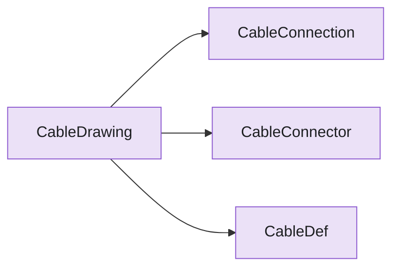

# Package `cable`

> Generated by `scripts/type_graph.py` from the live code. Do not edit; regenerate with `just type-graph`.

9 types.

## Structure inside the package

Fields, hub attributes and inheritance between this package's own types.

## Cross-package references

**Uses**

| Package | Types |
|---|---|
| `catalog` | `CableData`, `CableId`, `ConnectorData`, `ConnectorId`, `ConnectorInstance`, `DeviceTag`, `PartId`, `ResolvedCatalog`, `Wire` |
| `electrical` | `FieldDevice` |

**Used by**

none

## Types

### PinSortConfig

`cable.builder` - dataclass, frozen

Configuration for how synthesized connector pins are sorted.

| Field | Type |
|---|---|
| `sort_integers` | `bool` |
| `sort_alphabetic` | `bool` |

Used by: `CableDrawing`

### CableBuilder

`cable.cable_builder` - hub

Mutable builder for one cable's wires and connectors.

| Uses | Kind | Via |
|---|---|---|
| `CableBuildResult` | returns | `build` |
| `ConnectorInstance` | holds, takes | `_connectors`, `add_connector` |
| `CableId` | takes | `__init__` |
| `ConnectorId` | holds | `_connectors` |
| `DeviceTag` | holds | `_connectors` |
| `PartId` | holds, takes | `_cable_product`, `set_cable_product` |
| `ResolvedCatalog` | takes | `__init__` |
| `Wire` | holds, takes | `_wires`, `add_wire` |

### CableRun

`cable.cable_run` - dataclass, frozen

A device-to-device cable declared as catalog Wires.

| Field | Type |
|---|---|
| `wires` | `tuple[Wire, ...]` |
| `cable` | `CableData` |
| `connectors` | `tuple[tuple[PinRef, ConnectorData], ...]` |

Used by: `CableDrawing`

### CableConnection

`cable.model` - dataclass, frozen

A single wire-level connection through a cable.

| Field | Type |
|---|---|
| `from_connector` | `str` |
| `from_pin` | `str` |
| `cable` | `str` |
| `wire` | `int` |
| `to_connector` | `str` |
| `to_pin` | `str` |

Used by: `CableDrawing`

### CableConnector

`cable.model` - dataclass, frozen

One end of a cable connection (device or terminal block).

| Field | Type |
|---|---|
| `designator` | `str` |
| `pins` | `tuple[str, ...]` |
| `type` | `str` |
| `subtype` | `str` |
| `style` | `str` |
| `notes` | `str` |
| `mpn` | `str` |
| `pincount` | `int \| None` |
| `show_pincount` | `bool` |
| `loops` | `tuple[tuple[str, str], ...]` |

Used by: `CableDrawing`

### CableDef

`cable.model` - dataclass, frozen

Physical cable properties.

| Field | Type |
|---|---|
| `designator` | `str` |
| `wirecount` | `int` |
| `wire_gauge` | `float` |
| `gauge_unit` | `str` |
| `length` | `float` |
| `category` | `str` |
| `wire_colors` | `tuple[str, ...]` |
| `notes` | `str` |
| `shield` | `bool` |
| `wirelabels` | `tuple[str \| None, ...]` |

Used by: `CableDrawing`

### CableDrawing

`cable.model` - dataclass, frozen

One cable + its connectors + wire-level connections; renders to one SVG.

| Field | Type |
|---|---|
| `cable` | `CableDef` |
| `connectors` | `tuple[CableConnector, ...]` |
| `connections` | `tuple[CableConnection, ...]` |
| `title` | `str` |
| `from_designator` | `str` |
| `to_designators` | `tuple[str, ...]` |

### CableRenderConfig

`cable.render_config` - dataclass, frozen

Presentation flags for rendering a cable, keyed by connector name.

| Field | Type |
|---|---|
| `show_pincount` | `frozenset[ConnectorId]` |

Used by: `CableDrawing`

### CableBuildResult

`cable.result` - dataclass, frozen

A resolved cable: its wires, connector instances, and product key.

| Field | Type |
|---|---|
| `name` | `CableId` |
| `wires` | `tuple[Wire, ...]` |
| `connectors` | `tuple[ConnectorInstance, ...]` |
| `cable_product` | `PartId` |

Used by: `CableBuilder`, `CableDrawing`
