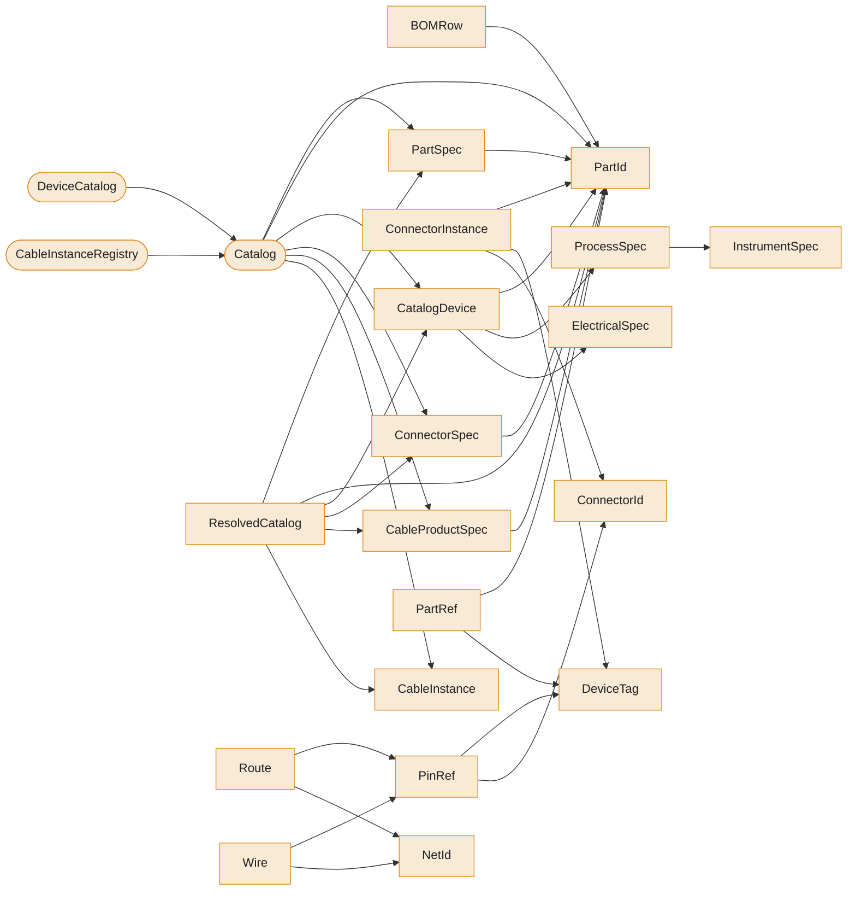

# Package `catalog`

> Generated by `scripts/type_graph.py` from the live code. Do not edit; regenerate with `just type-graph`.

27 types.

## Structure inside the package

Fields, hub attributes and inheritance between this package's own types.

## Cross-package references

**Uses**

| Package | Types |
|---|---|
| `core` | `TerminalRegistry` |
| `electrical` | `PlcAssignment`, `Terminal` |

**Used by**

| Package | Types |
|---|---|
| `cable` | `CableBuildResult`, `CableBuilder`, `CableDrawing`, `CableRenderConfig`, `CableRun` |
| `electrical` | `DeviceCable`, `FieldDevice`, `Harness`, `HarnessBuildResult`, `PlcAssignment`, `_RouteDecl` |
| `pid` | `PIDBuilder` |
| `project` | `Project` |

## Types

### BOMRow

`catalog.bom` - dataclass, frozen

One consolidated BOM row.

| Field | Type |
|---|---|
| `part` | `PartId` |
| `count` | `int` |
| `used_by` | `tuple[str, ...]` |

### CableData

`catalog.cables` - dataclass, frozen

Physical cable properties for a field device connection.

| Field | Type |
|---|---|
| `wire_gauge` | `float` |
| `wire_colors` | `tuple[str, ...] \| None` |
| `cable_length` | `float \| None` |
| `cable_note` | `str \| None` |
| `category` | `str` |

Used by: `CableRun`, `DeviceCable`, `FieldDevice`

### CableInstance

`catalog.cables` - dataclass, frozen

A per-project cable connection between two devices or subsystems.

| Field | Type |
|---|---|
| `tag` | `str` |
| `spec` | `str` |
| `cable_type` | `str` |
| `from_device` | `str` |
| `to_device` | `str` |
| `description` | `str` |

Used by: `CableInstanceRegistry`, `Catalog`, `ResolvedCatalog`

### CableInstanceRegistry

`catalog.cables` - hub

Deprecated cable-only face of ``Catalog``.

| Uses | Kind | Via |
|---|---|---|
| `CableInstance` | returns, takes | `get`, `register` |
| `Catalog` | inherits |  |

### CableProductSpec

`catalog.cables` - dataclass, frozen

Canonical cable product specification (e.g. 'Lapp OELFLEX 110 4x0.75').

| Field | Type |
|---|---|
| `part` | `PartId` |
| `conductor_count` | `int` |
| `default_length_mm` | `float \| None` |
| `gauge_mm2` | `float \| None` |
| `category` | `str \| None` |
| `type` | `str \| None` |
| `subtype` | `str \| None` |
| `notes` | `str \| None` |

Used by: `Catalog`, `ResolvedCatalog`

### ConnectorData

`catalog.cables` - dataclass, frozen

Physical connector properties for one connector on a field device.

| Field | Type |
|---|---|
| `pins` | `tuple[str, ...]` |
| `type` | `str \| None` |
| `subtype` | `str \| None` |
| `style` | `str \| None` |
| `notes` | `str \| None` |
| `mpn` | `str \| None` |
| `pincount` | `int \| None` |
| `loops` | `tuple[tuple[int \| str, int \| str], ...] \| None` |

Used by: `CableRun`, `DeviceCable`, `FieldDevice`

### ConnectorInstance

`catalog.connectors` - dataclass, frozen

A project-level connector instance.

| Field | Type |
|---|---|
| `device` | `DeviceTag` |
| `name` | `ConnectorId` |
| `part` | `PartId` |
| `notes` | `str \| None` |

Used by: `CableBuildResult`, `CableBuilder`

### ConnectorSpec

`catalog.connectors` - dataclass, frozen

Canonical connector product specification.

| Field | Type |
|---|---|
| `part` | `PartId` |
| `pincount` | `int` |
| `pins` | `tuple[str, ...]` |
| `style` | `str \| None` |
| `notes` | `str \| None` |

Used by: `Catalog`, `ResolvedCatalog`

### CatalogDevice

`catalog.device` - dataclass, frozen

A device that appears on both P&ID and electrical drawings.

| Field | Type |
|---|---|
| `tag` | `str` |
| `description` | `str` |
| `manufacturer` | `str` |
| `model` | `str` |
| `part` | `PartId \| None` |
| `process` | `ProcessSpec \| None` |
| `electrical` | `ElectricalSpec \| None` |

Used by: `Catalog`, `DeviceCatalog`, `ResolvedCatalog`

### ElectricalSpec

`catalog.device` - dataclass, frozen

How a device appears on electrical drawings.

| Field | Type |
|---|---|
| `terminal` | `str` |
| `pin_count` | `int` |
| `cable` | `str \| None` |
| `signal_type` | `str` |

Used by: `CatalogDevice`

### InstrumentSpec

`catalog.device` - dataclass, frozen

ISA 5.1 instrument identification for a field instrument.

| Field | Type |
|---|---|
| `letters` | `str` |
| `number` | `str` |
| `location` | `str` |

Used by: `ProcessSpec`

### ProcessSpec

`catalog.device` - dataclass, frozen

How a device appears on P&ID drawings.

| Field | Type |
|---|---|
| `instrument` | `InstrumentSpec` |
| `service` | `str` |
| `range` | `str` |
| `output` | `str` |

Used by: `CatalogDevice`

### CableId

`catalog.identifiers` - scalar

Cable instance handle, e.g. ``CableId("W12")``.

Used by: `CableBuildResult`, `CableBuilder`

### CircuitId

`catalog.identifiers` - scalar

Project-level circuit key (replaces the ``project._results`` str key).

### ConnectorId

`catalog.identifiers` - scalar

Per-project connector instance handle, e.g. ``ConnectorId("J1")``.

Used by: `CableBuilder`, `CableRenderConfig`, `ConnectorInstance`, `PinRef`

### DeviceTag

`catalog.identifiers` - scalar

Per-circuit device tag, e.g. ``DeviceTag("-Q1")``.

Used by: `CableBuilder`, `ConnectorInstance`, `PartRef`, `PinRef`

### NetId

`catalog.identifiers` - scalar

Canonical net name. Rejects any string containing ``'/'``.

Used by: `Harness`, `PlcAssignment`, `Project`, `Route`, `Wire`, `_RouteDecl`

### PartId

`catalog.identifiers` - scalar

Catalog primary key, e.g. ``PartId("phoenix_3pos")``.

Used by: `BOMRow`, `CableBuildResult`, `CableBuilder`, `CableProductSpec`, `Catalog`, `CatalogDevice`, `ConnectorInstance`, `ConnectorSpec`, `PartRef`, `PartSpec`, `ResolvedCatalog`

### TagPrefix

`catalog.identifiers` - scalar

IEC prefix for ``reuse_tags`` maps, e.g. ``TagPrefix("K")``.

### PartSpec

`catalog.parts` - dataclass, frozen

Canonical part specification; ``mpn`` is the manufacturer part number.

| Field | Type |
|---|---|
| `part` | `PartId` |
| `mpn` | `str` |
| `category` | `PartCategory` |
| `description` | `str` |
| `manufacturer` | `str \| None` |
| `notes` | `str \| None` |

Used by: `Catalog`, `ResolvedCatalog`

### PartRef

`catalog.refs` - dataclass, frozen

Catalog ref returned from a ``Catalog.add_*`` builder call.

| Field | Type |
|---|---|
| `part` | `PartId` |
| `tag` | `DeviceTag \| None` |

Used by: `Catalog`

### PinRef

`catalog.refs` - dataclass, frozen

Reference to a physical pin on a connector instance.

| Field | Type |
|---|---|
| `device` | `DeviceTag` |
| `connector` | `ConnectorId \| None` |
| `port_id` | `str` |

Used by: `Harness`, `PlcAssignment`, `Route`, `Wire`, `_RouteDecl`

### Catalog

`catalog.registry` - hub

Single source of truth for project devices and cable instances.

| Uses | Kind | Via |
|---|---|---|
| `CableInstance` | holds, returns, takes | `_cables`, `add_cable_instance`, `by_device`, `get_cable_instance` |
| `CableProductSpec` | holds, takes | `_cable_products`, `add_cable_product` |
| `ConnectorSpec` | holds, takes | `_connectors`, `add_connector` |
| `CatalogDevice` | holds, returns, takes | `_devices`, `add_device`, `cross_referenced`, `electrical_devices`, `get_device`, `instruments` |
| `PartId` | holds | `_cable_products`, `_connectors`, `_parts` |
| `PartSpec` | holds, takes | `_parts`, `add_part` |
| `PartRef` | returns | `add_cable_product`, `add_connector`, `add_part` |
| `ResolvedCatalog` | returns | `build` |

Used by: `CableInstanceRegistry`, `DeviceCatalog`

### DeviceCatalog

`catalog.registry` - hub

Deprecated device-only face of ``Catalog``.

| Uses | Kind | Via |
|---|---|---|
| `CatalogDevice` | returns, takes | `get`, `register` |
| `Catalog` | inherits |  |

Used by: `PIDBuilder`, `Project`

### ResolvedCatalog

`catalog.result` - dataclass, frozen

Frozen, pure-resolver snapshot. All lookups are O(1) dict reads.

| Field | Type |
|---|---|
| `parts` | `Mapping[PartId, PartSpec]` |
| `connectors` | `Mapping[PartId, ConnectorSpec]` |
| `cable_products` | `Mapping[PartId, CableProductSpec]` |
| `devices` | `Mapping[str, CatalogDevice]` |
| `cable_instances` | `Mapping[str, CableInstance]` |

Used by: `CableBuilder`, `CableDrawing`, `Catalog`

### Route

`catalog.routes` - dataclass, frozen

A signal routed through ``N >= 2`` concrete waypoints.

| Field | Type |
|---|---|
| `net` | `NetId` |
| `waypoints` | `tuple[PinRef, ...]` |

Used by: `Wire`

### Wire

`catalog.wires` - dataclass, frozen

Logical connection record between two pins on a net.

| Field | Type |
|---|---|
| `net` | `NetId` |
| `source` | `PinRef` |
| `target` | `PinRef` |
| `color` | `str \| None` |
| `length_mm` | `float \| None` |
| `notes` | `str \| None` |

Used by: `CableBuildResult`, `CableBuilder`, `CableRun`, `HarnessBuildResult`, `Project`
