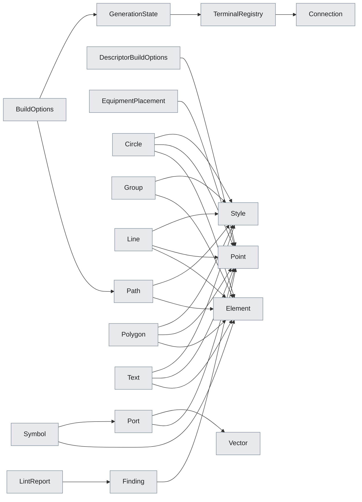

# Package `core`

> Generated by `scripts/type_graph.py` from the live code. Do not edit; regenerate with `just type-graph`.

43 types.

## Structure inside the package

Fields, hub attributes and inheritance between this package's own types.

## Cross-package references

**Uses**

| Package | Types |
|---|---|
| `electrical` | `BridgeMode`, `BuildResult`, `Circuit`, `CircuitBuilder`, `ComponentRef`, `ConnectionNode`, `InternalDevice`, `PortRef`, `RouterConfig` |
| `pcb` | `LayoutSpec`, `Severity` |
| `pid` | `PIDDiagram`, `PipeStyle`, `Placement` |

**Used by**

| Package | Types |
|---|---|
| `catalog` | `Wire` |
| `electrical` | `BuildResult`, `Circuit`, `CircuitBuilder`, `CompDescriptor`, `ConnectionNode`, `LayoutResult`, `RealizedComponent`, `RoutePair`, `RoutingInput`, `TerminalBlock`, `TerminalSidecar`, `TerminalSymbol` |
| `pcb` | `PlacedSlice`, `PowerNetMap`, `SymbolSlice`, `_PageCtx` |
| `pid` | `PIDBuildResult`, `PIDBuilder`, `PIDDiagram`, `Placement`, `_EquipmentEntry` |

## Types

### BoundingBox

`core.bbox` - dataclass, frozen

Axis-aligned bounding box in diagram coordinates (mm).

| Field | Type |
|---|---|
| `min_x` | `float` |
| `max_x` | `float` |
| `min_y` | `float` |
| `max_y` | `float` |

Used by: `Point`

### Connection

`core.connection_registry` - dataclass, frozen

Represents a connection between a terminal pin and a component pin.

| Field | Type |
|---|---|
| `terminal_tag` | `str` |
| `terminal_pin` | `str` |
| `component_tag` | `str` |
| `component_pin` | `str` |
| `side` | `str` |

Used by: `TerminalRegistry`

### TerminalRegistry

`core.connection_registry` - dataclass, frozen

Immutable registry for terminal connections.

| Field | Type |
|---|---|
| `connections` | `tuple[Connection, ...]` |

Used by: `GenerationState`, `TerminalSidecar`, `Wire`

### Element

`core.geometry` - dataclass, frozen

Base class for all geometric primitives and symbols.

Used by: `BoundingBox`, `Circle`, `Circuit`, `ConnectionNode`, `Group`, `Line`, `LintReport`, `PIDDiagram`, `Path`, `Polygon`, `Symbol`, `TerminalBlock`, +2 more

### Point

`core.geometry` - dataclass, frozen

2D point.

| Field | Type |
|---|---|
| `x` | `float` |
| `y` | `float` |

Used by: `Circle`, `CircuitBuilder`, `ConnectionNode`, `DescriptorBuildOptions`, `Element`, `EquipmentPlacement`, `Finding`, `Line`, `PIDBuilder`, `Polygon`, `Port`, `RoutePair`, +4 more

### Style

`core.geometry` - dataclass, frozen

SVG style attributes.

| Field | Type |
|---|---|
| `stroke` | `str` |
| `stroke_width` | `float` |
| `fill` | `str` |
| `stroke_dasharray` | `str \| None` |
| `opacity` | `float` |
| `font_family` | `str \| None` |

Used by: `Circle`, `Group`, `Line`, `Path`, `Polygon`, `Text`

### Vector

`core.geometry` - dataclass, frozen

2D vector (direction + magnitude).

| Field | Type |
|---|---|
| `dx` | `float` |
| `dy` | `float` |

Used by: `Placement`, `Port`, `Symbol`

### Finding

`core.geometry_lint` - dataclass, frozen

One lint finding; `weight` contributes to `LintReport.cost`.

| Field | Type |
|---|---|
| `kind` | `str` |
| `severity` | `Severity` |
| `message` | `str` |
| `location` | `Point` |
| `weight` | `float` |

Used by: `LintReport`

### LintReport

`core.geometry_lint` - dataclass, frozen

All findings from one lint pass, plus the derived scalar cost.

| Field | Type |
|---|---|
| `findings` | `tuple[Finding, ...]` |

### BuildOptions

`core.options` - dataclass, frozen

Options bundle for :meth:`CircuitBuilder.build` (count, state, reuse, labels).

| Field | Type |
|---|---|
| `count` | `int` |
| `state` | `GenerationState \| None` |
| `wire_labels` | `Sequence[str] \| None` |
| `connection_log_path` | `str \| Path \| None` |
| `start_indices` | `Mapping[str, int] \| None` |
| `terminal_start_indices` | `Mapping[str, int] \| None` |
| `tag_generators` | `Mapping[str, Callable[..., Any]] \| None` |
| `fixed_tags` | `Mapping[str, str] \| None` |
| `terminal_maps` | `Mapping[str, Any] \| None` |
| `reuse_tags` | `Mapping[str, BuildResult] \| None` |
| `reuse_terminals` | `Mapping[str, BuildResult \| CircuitBuilder \| Callable[..., Any]] \| None` |

Used by: `CircuitBuilder`

### ConnectionOptions

`core.options` - dataclass, frozen

Chain-wiring: previous/next, side, bridge (None=BridgeMode.NONE), wire label.

| Field | Type |
|---|---|
| `connect_from_previous` | `bool` |
| `connect_to_next` | `bool` |
| `connection_side` | `Side \| None` |
| `bridge` | `BridgeMode \| None` |
| `wire_label` | `str \| None` |

Used by: `CircuitBuilder`

### DescriptorBuildOptions

`core.options` - dataclass, frozen

Layout + tagging options for build_from_descriptors.

| Field | Type |
|---|---|
| `position` | `Point \| None` |
| `x` | `float` |
| `y` | `float` |
| `spacing` | `float` |
| `count` | `int` |
| `wire_labels` | `tuple[str, ...] \| None` |
| `reuse_tags` | `Mapping[str, Any] \| None` |
| `tag_generators` | `Mapping[str, Callable[..., Any]] \| None` |
| `start_indices` | `Mapping[str, int] \| None` |
| `terminal_start_indices` | `Mapping[str, int] \| None` |

Used by: `BuildResult`

### EquipmentConfig

`core.options` - dataclass, frozen

PID equipment factory + tag prefix + factory passthrough.

| Field | Type |
|---|---|
| `factory` | `SymbolFactory` |
| `tag_prefix` | `str` |
| `factory_kwargs` | `Mapping[str, Any] \| None` |

Used by: `PIDBuilder`

### EquipmentPlacement

`core.options` - dataclass, frozen

PID equipment placement: anchor-relative or absolute (position/x/y).

| Field | Type |
|---|---|
| `relative_to` | `str \| None` |
| `from_port` | `str` |
| `to_port` | `str` |
| `offset` | `tuple[float, float]` |
| `position` | `Point \| None` |
| `x` | `float` |
| `y` | `float` |

Used by: `PIDBuilder`

### HorizontalLayoutConfig

`core.options` - dataclass, frozen

All knobs for create_horizontal_layout.

| Field | Type |
|---|---|
| `start_x` | `float` |
| `start_y` | `float` |
| `count` | `int` |
| `spacing` | `float` |
| `generator_func_single` | `Callable[..., Any]` |
| `default_tag_generators` | `Mapping[str, Callable[..., Any]]` |
| `tag_generators` | `Mapping[str, Callable[..., Any]] \| None` |
| `terminal_maps` | `Mapping[str, Any] \| None` |

### PlacementOptions

`core.options` - dataclass, frozen

Where a new component sits relative to the chain head or another component.

| Field | Type |
|---|---|
| `relative_to` | `ComponentRef \| PortRef \| None` |
| `position` | `Position` |
| `spacing` | `float \| None` |
| `x_offset` | `float` |

Used by: `CircuitBuilder`

### SpdtConfig

`core.options` - dataclass, frozen

Pin layout + IEC inversion + device + wire labels for an SPDT contact.

| Field | Type |
|---|---|
| `poles` | `int` |
| `pins` | `tuple[str, ...] \| None` |
| `inverted` | `bool` |
| `device` | `InternalDevice \| None` |
| `wire_labels_above` | `tuple[str, ...] \| None` |

Used by: `CircuitBuilder`

### SymbolConfig

`core.options` - dataclass, frozen

Tag prefix, pin layout, device, wire labels, factory passthrough for a Symbol.

| Field | Type |
|---|---|
| `tag_prefix` | `str` |
| `poles` | `int` |
| `pins` | `tuple[str, ...] \| None` |
| `device` | `InternalDevice \| None` |
| `wire_labels_above` | `tuple[str, ...] \| None` |
| `factory_kwargs` | `Mapping[str, Any] \| None` |

Used by: `CircuitBuilder`

### TerminalConfig

`core.options` - dataclass, frozen

Pin layout + logical mapping for a Terminal.

| Field | Type |
|---|---|
| `poles` | `int` |
| `pins` | `tuple[str, ...] \| None` |
| `pin_prefixes` | `tuple[str, ...] \| None` |
| `logical_name` | `str \| None` |

Used by: `CircuitBuilder`

### TerminalDisplayOptions

`core.options` - dataclass, frozen

Label-position knobs for a terminal's text labels.

| Field | Type |
|---|---|
| `label_pos` | `LabelPosition \| None` |
| `pin_label_pos` | `LabelPosition \| None` |

Used by: `CircuitBuilder`

### _ConnectionPair

`core.options` - dataclass, frozen

Endpoint pair (from + to) for _register_connection_pair dispatch.

| Field | Type |
|---|---|
| `comp_from` | `dict[str, Any]` |
| `pin_from` | `str` |
| `side_from` | `str \| None` |
| `p_from` | `int` |
| `comp_to` | `dict[str, Any]` |
| `pin_to` | `str` |
| `side_to` | `str \| None` |
| `p_to` | `int` |

### _WalkLoopContext

`core.options` - dataclass, frozen

Mutable working state shared across _walk_loop iterations.

| Field | Type |
|---|---|
| `placed` | `list[Any]` |
| `ir` | `Any` |
| `mapping` | `Any` |
| `net_kinds` | `Mapping[str, Any]` |
| `walked_chain_nets` | `set[str]` |
| `placed_slices` | `set[tuple[str, int]]` |
| `net_by_pin` | `Mapping[tuple[str, str], Any]` |

### Circle

`core.primitives` - dataclass, frozen

A circle.

| Field | Type |
|---|---|
| `center` | `Point` |
| `radius` | `float` |
| `style` | `Style` |

### Group

`core.primitives` - dataclass, frozen

Logical group; *style*, if set, is inherited by children at render time.

| Field | Type |
|---|---|
| `elements` | `list[Element]` |
| `style` | `Style \| None` |

### Line

`core.primitives` - dataclass, frozen

A straight line segment.

| Field | Type |
|---|---|
| `start` | `Point` |
| `end` | `Point` |
| `style` | `Style` |

Used by: `ConnectionNode`, `Finding`, `LayoutResult`, `_PageCtx`

### Path

`core.primitives` - dataclass, frozen

A generic SVG path.

| Field | Type |
|---|---|
| `d` | `str` |
| `style` | `Style` |

Used by: `BuildOptions`

### Polygon

`core.primitives` - dataclass, frozen

A polygon from a list of vertex points.

| Field | Type |
|---|---|
| `points` | `list[Point]` |
| `style` | `Style` |

### Text

`core.primitives` - dataclass, frozen

Text element.

| Field | Type |
|---|---|
| `content` | `str` |
| `position` | `Point` |
| `style` | `Style` |
| `anchor` | `str` |
| `dominant_baseline` | `str` |
| `font_size` | `float` |
| `rotation` | `float` |

Used by: `Finding`, `_PageCtx`

### GenerationState

`core.state` - dataclass, frozen

Immutable state container threaded through all circuit generation calls.

| Field | Type |
|---|---|
| `tags` | `dict[str, int]` |
| `terminal_counters` | `dict[str, int]` |
| `terminal_prefix_counters` | `dict[str, dict[str, int]]` |
| `contact_channels` | `dict[str, int]` |
| `terminal_registry` | `TerminalRegistry` |
| `pin_counter` | `int` |

Used by: `BuildOptions`, `BuildResult`, `CircuitBuilder`, `PIDBuildResult`, `PIDBuilder`, `TerminalRegistry`

### Close

`core.svg_path` - dataclass, frozen

Preserves original 'Z' vs 'z' case.

| Field | Type |
|---|---|
| `case` | `str` |

### Curve

`core.svg_path` - dataclass, frozen

Absolute C command (cubic bezier).

| Field | Type |
|---|---|
| `x1` | `float` |
| `y1` | `float` |
| `x2` | `float` |
| `y2` | `float` |
| `x` | `float` |
| `y` | `float` |

### HLine

`core.svg_path` - dataclass, frozen

Absolute H command.

| Field | Type |
|---|---|
| `x` | `float` |

### Line

`core.svg_path` - dataclass, frozen

Absolute L command.

| Field | Type |
|---|---|
| `x` | `float` |
| `y` | `float` |

### Move

`core.svg_path` - dataclass, frozen

Absolute M command.

| Field | Type |
|---|---|
| `x` | `float` |
| `y` | `float` |

### PassThrough

`core.svg_path` - dataclass, frozen

Non-absolute or unknown token — round-trips unchanged.

| Field | Type |
|---|---|
| `token` | `str` |

### Quad

`core.svg_path` - dataclass, frozen

Absolute Q command (quadratic bezier).

| Field | Type |
|---|---|
| `x1` | `float` |
| `y1` | `float` |
| `x` | `float` |
| `y` | `float` |

### Smooth

`core.svg_path` - dataclass, frozen

Absolute S command (smooth cubic bezier).

| Field | Type |
|---|---|
| `x2` | `float` |
| `y2` | `float` |
| `x` | `float` |
| `y` | `float` |

### Tangent

`core.svg_path` - dataclass, frozen

Absolute T command (smooth quadratic bezier).

| Field | Type |
|---|---|
| `x` | `float` |
| `y` | `float` |

### VLine

`core.svg_path` - dataclass, frozen

Absolute V command.

| Field | Type |
|---|---|
| `y` | `float` |

### Port

`core.symbol` - dataclass, frozen

A connection point on a symbol.

| Field | Type |
|---|---|
| `id` | `str` |
| `position` | `Point` |
| `direction` | `Vector` |

Used by: `Symbol`, `TerminalBlock`, `TerminalSymbol`

### Symbol

`core.symbol` - dataclass, frozen

A reusable component composed of primitives and ports.

| Field | Type |
|---|---|
| `elements` | `list[Element]` |
| `ports` | `dict[str, Port]` |
| `label` | `str \| None` |

Used by: `BoundingBox`, `BuildResult`, `Circuit`, `CircuitBuilder`, `CompDescriptor`, `ConnectionNode`, `Element`, `Line`, `PIDDiagram`, `PlacedSlice`, `Port`, `PowerNetMap`, +7 more

### ValidationResult

`core.validation` - dataclass, mutable

Result of diagram layout validation.

| Field | Type |
|---|---|
| `passed` | `bool` |
| `warnings` | `list[str]` |
| `errors` | `list[str]` |

### _Bbox

`core.validation_geometry` - namedtuple

_Bbox(xmin, ymin, xmax, ymax)
