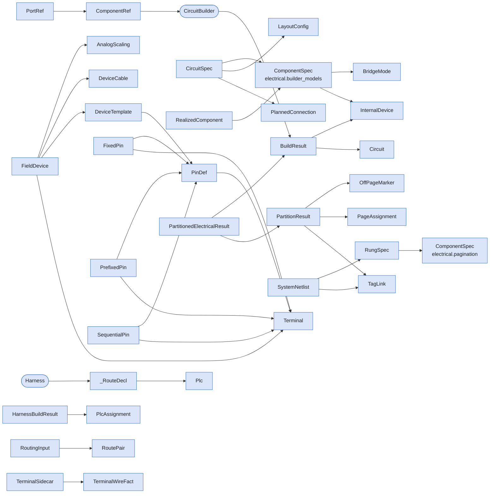

# Package `electrical`

> Generated by `scripts/type_graph.py` from the live code. Do not edit; regenerate with `just type-graph`.

51 types.

## Structure inside the package

Fields, hub attributes and inheritance between this package's own types.

## Cross-package references

**Uses**

| Package | Types |
|---|---|
| `catalog` | `CableData`, `ConnectorData`, `NetId`, `PinRef`, `Wire` |
| `core` | `BuildOptions`, `ConnectionOptions`, `DescriptorBuildOptions`, `Element`, `GenerationState`, `Line`, `PlacementOptions`, `Point`, `Port`, `SpdtConfig`, `Symbol`, `SymbolConfig`, `TerminalConfig`, `TerminalDisplayOptions`, `TerminalRegistry` |
| `pcb` | `ConnectorBlock`, `FloatingPart`, `LayoutSpec`, `SymbolMapping` |

**Used by**

| Package | Types |
|---|---|
| `cable` | `CableDrawing` |
| `catalog` | `NetId`, `Wire` |
| `core` | `BuildOptions`, `ConnectionOptions`, `PlacementOptions`, `Point`, `SpdtConfig`, `Symbol`, `SymbolConfig`, `ValidationResult` |
| `project` | `Project`, `_CircuitDef` |

## Types

### CircuitBuilder

`electrical.builder` - hub

Fluent builder for IEC 60617 electrical circuits; freezes on :meth:`build`.

| Uses | Kind | Via |
|---|---|---|
| `Point` | takes | `set_layout` |
| `BuildOptions` | takes | `build` |
| `ConnectionOptions` | takes | `add_reference`, `add_spdt`, `add_symbol`, `add_terminal` |
| `PlacementOptions` | takes | `add_reference`, `add_spdt`, `add_symbol`, `add_terminal` |
| `SpdtConfig` | takes | `add_spdt` |
| `SymbolConfig` | takes | `add_symbol` |
| `TerminalConfig` | takes | `add_terminal` |
| `TerminalDisplayOptions` | takes | `add_terminal` |
| `GenerationState` | takes | `__init__` |
| `Symbol` | takes | `add_symbol` |
| `BuildResult` | holds, returns | `_result`, `build` |
| `ComponentRef` | returns, takes | `add_reference`, `add_spdt`, `add_symbol`, `add_terminal`, `connect_matching` |
| `PortRef` | takes | `connect` |
| `Terminal` | takes | `add_terminal` |

Used by: `BuildOptions`, `ComponentRef`

### BridgeMode

`electrical.builder_models` - enum

Bridge mode for terminal blocks: controls how adjacent poles are jumpered.

| Member | Value |
|---|---|
| `NONE` | `'none'` |
| `ALL` | `'all'` |
| `AUTO` | `'auto'` |
| `PER_PREFIX` | `'per_prefix'` |

Used by: `ComponentSpec`, `ConnectionOptions`

### BuildResult

`electrical.builder_models` - dataclass, mutable

Frozen output from :meth:`~schematika.electrical.CircuitBuilder.build`.

| Field | Type |
|---|---|
| `state` | `GenerationState` |
| `circuit` | `Circuit` |
| `used_terminals` | `list[Any]` |
| `component_map` | `dict[str, list[str]]` |
| `terminal_pin_map` | `dict[str, list[str]]` |
| `device_registry` | `dict[str, InternalDevice]` |
| `wire_connections` | `list[tuple[str, str, str, str]]` |
| `wire_connection_symbols` | `list[tuple[Symbol \| None, Symbol \| None]]` |
| `bridge_groups` | `dict[str, list[tuple[int, int]]]` |
| `connection_log` | `list[str]` |

Used by: `BuildOptions`, `CircuitBuilder`, `Harness`, `LayoutResult`, `PartitionedElectricalResult`, `Project`, `RoutingInput`

### CircuitSpec

`electrical.builder_models` - dataclass, mutable

Complete specification for a circuit definition.

| Field | Type |
|---|---|
| `components` | `list[ComponentSpec]` |
| `layout` | `LayoutConfig` |
| `planned_connections` | `list[PlannedConnection]` |
| `manual_connections` | `list[tuple[int, int, int, int, str, str]]` |
| `terminal_map` | `dict[str, Any]` |
| `matching_connections` | `list[tuple[int, int, list[str] \| None, str, str]]` |
| `connection_wire_labels` | `dict[int, str]` |

### ComponentRef

`electrical.builder_models` - dataclass, mutable

Reference to a component in a CircuitBuilder.

| Field | Type |
|---|---|
| `_builder` | `CircuitBuilder` |
| `_index` | `int` |
| `tag_prefix` | `str` |

Used by: `CircuitBuilder`, `PlacementOptions`, `PortRef`

### ComponentSpec

`electrical.builder_models` - dataclass, frozen

Declarative specification for a component in a circuit.

| Field | Type |
|---|---|
| `func` | `SymbolFactory \| None` |
| `kind` | `str` |
| `tag_prefix` | `str \| None` |
| `poles` | `int` |
| `pins` | `list[str] \| tuple[str, ...] \| None` |
| `kwargs` | `dict[str, Any]` |
| `x_offset` | `float` |
| `y_increment` | `float \| None` |
| `connect_to_next` | `bool` |
| `connection_side` | `Side \| None` |
| `pin_prefixes` | `tuple[str, ...] \| None` |
| `placed_right_of` | `int \| None` |
| `placed_above_of` | `tuple[int, str] \| None` |
| `placed_below_of` | `tuple[int, str] \| None` |
| `device` | `InternalDevice \| None` |
| `bridge` | `BridgeMode` |
| `wire_labels_above` | `list[str] \| tuple[str, ...] \| None` |
| `relative_to_idx` | `int \| tuple[int, str] \| None` |
| `position` | `Position` |
| `connect_from_previous` | `bool` |
| `spacing_override` | `float \| None` |

Used by: `CircuitSpec`, `RealizedComponent`

### LayoutConfig

`electrical.builder_models` - dataclass, frozen

Configuration for circuit layout.

| Field | Type |
|---|---|
| `start_x` | `float` |
| `start_y` | `float` |
| `spacing` | `float` |
| `symbol_spacing` | `float` |
| `label_pos` | `LabelPosition` |

Used by: `CircuitSpec`

### PlannedConnection

`electrical.builder_models` - dataclass, frozen

A connection recorded at add-time, rendered in Phase 4.

| Field | Type |
|---|---|
| `source_idx` | `int` |
| `target_idx` | `int` |
| `kind` | `str` |
| `source_pole` | `int \| None` |
| `target_pole` | `int \| None` |
| `side_a` | `Side` |
| `side_b` | `Side` |
| `wire_label` | `str \| None` |

Used by: `CircuitSpec`

### PortRef

`electrical.builder_models` - dataclass, mutable

Reference to a specific port on a component.

| Field | Type |
|---|---|
| `component` | `ComponentRef` |
| `port` | `str \| int` |

Used by: `CircuitBuilder`, `PlacementOptions`

### RealizedComponent

`electrical.builder_models` - dataclass, frozen

An in-flight build artifact tracked across the four-phase pipeline.

| Field | Type |
|---|---|
| `spec` | `ComponentSpec` |
| `tag` | `str` |
| `pins` | `tuple[str, ...]` |
| `y` | `float` |
| `symbol` | `Symbol \| None` |

### CompDescriptor

`electrical.descriptors` - dataclass, frozen

Describes a component with tag prefix and pins.

| Field | Type |
|---|---|
| `symbol_fn` | `Callable[..., Symbol]` |
| `tag_prefix` | `str` |
| `pins` | `tuple[str, ...]` |

Used by: `BuildResult`, `Project`, `_CircuitDef`

### RefDescriptor

`electrical.descriptors` - dataclass, frozen

Describes a reference symbol (PLC, etc.).

| Field | Type |
|---|---|
| `terminal_id` | `str` |

Used by: `BuildResult`, `Project`, `_CircuitDef`

### TermDescriptor

`electrical.descriptors` - dataclass, frozen

Describes a physical terminal.

| Field | Type |
|---|---|
| `terminal_id` | `str` |
| `poles` | `int` |
| `pins` | `tuple[str, ...] \| None` |

Used by: `BuildResult`, `Project`, `_CircuitDef`

### AnalogScaling

`electrical.field_devices` - dataclass, frozen

Raw-to-engineering scaling for one analog instrument.

| Field | Type |
|---|---|
| `unit` | `str` |
| `raw_min` | `float` |
| `raw_max` | `float` |
| `eng_min` | `float` |
| `eng_max` | `float` |

Used by: `FieldDevice`

### DeviceCable

`electrical.field_devices` - dataclass, frozen

One cable+connector pair on a multi-cable device.

| Field | Type |
|---|---|
| `pins` | `tuple[str, ...]` |
| `cable` | `CableData` |
| `connector` | `ConnectorData \| None` |

Used by: `FieldDevice`

### DeviceTemplate

`electrical.field_devices` - dataclass, frozen

Reusable connection pattern for a field device type.

| Field | Type |
|---|---|
| `mpn` | `str` |
| `pins` | `tuple[PinDef, ...]` |

Used by: `FieldDevice`, `Harness`

### FieldDevice

`electrical.field_devices` - dataclass, frozen

A field device: connection template plus optional cable/connector data.

| Field | Type |
|---|---|
| `tag` | `str` |
| `template` | `DeviceTemplate` |
| `terminal` | `Terminal \| None` |
| `cable` | `CableData \| None` |
| `connectors` | `tuple[ConnectorData, ...] \| None` |
| `cables` | `tuple[DeviceCable, ...] \| None` |
| `scaling` | `AnalogScaling \| None` |
| `location` | `str` |

Used by: `CableDrawing`, `Harness`

### FixedPin

`electrical.field_devices` - dataclass, frozen

Literal pin name; requires `terminal_pin`, rejects `pin_prefix`.

| Field | Type |
|---|---|
| `device_pin` | `str` |
| `terminal` | `Terminal \| None` |
| `plc` | `Terminal \| None` |
| `terminal_pin` | `str` |
| `pin_prefix` | `str` |
| `function_suffix` | `str` |

### PinDef

`electrical.field_devices` - dataclass, frozen

Pin definition with three terminal numbering modes.

| Field | Type |
|---|---|
| `device_pin` | `str` |
| `terminal` | `Terminal \| None` |
| `plc` | `Terminal \| None` |
| `terminal_pin` | `str` |
| `pin_prefix` | `str` |
| `function_suffix` | `str` |

Used by: `DeviceTemplate`, `FixedPin`, `PrefixedPin`, `SequentialPin`

### PrefixedPin

`electrical.field_devices` - dataclass, frozen

Formatted `"{pin_prefix}:{group_index}"`; requires `pin_prefix`.

| Field | Type |
|---|---|
| `device_pin` | `str` |
| `terminal` | `Terminal \| None` |
| `plc` | `Terminal \| None` |
| `terminal_pin` | `str` |
| `pin_prefix` | `str` |
| `function_suffix` | `str` |

### SequentialPin

`electrical.field_devices` - dataclass, frozen

Auto-numbered slot; `pin_prefix` and `terminal_pin` must both be empty.

| Field | Type |
|---|---|
| `device_pin` | `str` |
| `terminal` | `Terminal \| None` |
| `plc` | `Terminal \| None` |
| `terminal_pin` | `str` |
| `pin_prefix` | `str` |
| `function_suffix` | `str` |

### Harness

`electrical.harness` - hub

Mutable builder: collect multi-point routes, resolve PLC + emit wires.

| Uses | Kind | Via |
|---|---|---|
| `NetId` | takes | `route` |
| `PinRef` | takes | `route` |
| `BuildResult` | takes | `add_field_devices` |
| `DeviceTemplate` | takes | `add_field_devices` |
| `FieldDevice` | takes | `add_field_devices` |
| `HarnessBuildResult` | returns | `build` |
| `Plc` | takes | `route` |
| `_RouteDecl` | holds | `_routes` |

### HarnessBuildResult

`electrical.harness` - dataclass, frozen

The frozen output of ``Harness.build()``.

| Field | Type |
|---|---|
| `wires` | `tuple[Wire, ...]` |
| `plc_assignments` | `tuple[PlcAssignment, ...]` |

Used by: `Harness`

### Plc

`electrical.harness` - dataclass, frozen

An unallocated PLC channel request, resolved against the rack at build().

| Field | Type |
|---|---|
| `signal_type` | `str` |
| `suffix` | `str` |

Used by: `Harness`, `Project`, `_RouteDecl`

### PlcAssignment

`electrical.harness` - dataclass, frozen

A resolved PLC channel — the row the PLC report needs.

| Field | Type |
|---|---|
| `module` | `str` |
| `mpn` | `str` |
| `channel` | `int` |
| `signal_type` | `str` |
| `pin_label` | `str` |
| `source` | `PinRef` |
| `net` | `NetId` |

Used by: `HarnessBuildResult`, `NetId`, `Project`

### _PlcRequest

`electrical.harness` - dataclass, frozen

One PLC channel to allocate (internal to build()).

| Field | Type |
|---|---|
| `signal_type` | `str` |
| `suffix` | `str` |
| `terminal_sort` | `tuple[str, str]` |
| `source_device` | `str` |
| `key` | `object` |

### _PlcResolved

`electrical.harness` - dataclass, frozen

One allocated PLC channel (internal).

| Field | Type |
|---|---|
| `key` | `object` |
| `designation` | `str` |
| `mpn` | `str` |
| `channel` | `int` |
| `signal_type` | `str` |
| `pin_label` | `str` |

### _RouteDecl

`electrical.harness` - dataclass, frozen

A collected route declaration, resolved at build().

| Field | Type |
|---|---|
| `waypoints` | `tuple[PinRef \| Plc, ...]` |
| `net` | `NetId \| None` |

Used by: `Harness`

### InternalDevice

`electrical.internal_device` - dataclass, frozen

Metadata for an internal cabinet component used in BOM generation.

| Field | Type |
|---|---|
| `prefix` | `str` |
| `mpn` | `str` |
| `description` | `str` |

Used by: `BuildResult`, `ComponentSpec`, `SpdtConfig`, `SymbolConfig`

### LayoutResult

`electrical.layout.router` - dataclass, frozen

Auto-routed wire geometry produced by `route_wires`.

| Field | Type |
|---|---|
| `wires` | `list[Line]` |
| `unresolved` | `list[WireConnection]` |
| `fallback_pairs` | `list[tuple[str, str]]` |

### RoutePair

`electrical.layout.router` - dataclass, frozen

One resolved (port, port) pair the router needs to connect.

| Field | Type |
|---|---|
| `from_tag` | `str` |
| `from_port_id` | `str` |
| `from_point` | `Point` |
| `from_symbol` | `Symbol` |
| `to_tag` | `str` |
| `to_port_id` | `str` |
| `to_point` | `Point` |
| `to_symbol` | `Symbol` |
| `resolution_kind` | `str` |

Used by: `RoutingInput`

### RouterConfig

`electrical.layout.router` - dataclass, frozen

Tunables for the A* cost model and per-route search scoping.

| Field | Type |
|---|---|
| `cell_size` | `float` |
| `turn_penalty` | `float` |
| `crossing_penalty` | `float` |
| `obstacle_clearance` | `float` |
| `search_margin` | `float` |

Used by: `LayoutResult`, `Point`

### RoutingInput

`electrical.layout.router` - dataclass, frozen

Everything the router needs, derived from a real `BuildResult`.

| Field | Type |
|---|---|
| `symbols_by_port` | `dict[tuple[str, str], Symbol]` |
| `all_symbols` | `list[Symbol]` |
| `pairs` | `list[RoutePair]` |
| `unresolved` | `list[WireConnection]` |

### ComponentSpec

`electrical.pagination` - dataclass, frozen

One link in a rung's chain: a physical terminal, a symbol, or a stub.

| Field | Type |
|---|---|
| `kind` | `ComponentKind` |
| `id_or_prefix` | `str` |
| `poles` | `int` |
| `symbol_fn` | `Callable[..., Any] \| None` |

Used by: `RungSpec`

### CrossPageFinding

`electrical.pagination` - dataclass, frozen

One violation found by `check_offpage_connector_coherence`.

| Field | Type |
|---|---|
| `kind` | `str` |
| `message` | `str` |

### OffPageMarker

`electrical.pagination` - dataclass, frozen

One half of an off-page connector pair, attached to one rung's chain end.

| Field | Type |
|---|---|
| `tag` | `str` |
| `boundary` | `Literal['start', 'end']` |
| `direction` | `Literal['up', 'down']` |
| `label` | `str` |

Used by: `PartitionResult`

### PageAssignment

`electrical.pagination` - dataclass, frozen

One page's worth of rungs, in render order.

| Field | Type |
|---|---|
| `number` | `int` |
| `title` | `str` |
| `rung_keys` | `tuple[str, ...]` |

Used by: `PartitionResult`

### PartitionResult

`electrical.pagination` - dataclass, frozen

The full output of `partition_netlist_to_pages`.

| Field | Type |
|---|---|
| `pages` | `tuple[PageAssignment, ...]` |
| `build_order` | `tuple[str, ...]` |
| `markers` | `dict[str, tuple[OffPageMarker, ...]]` |
| `plain_cross_refs` | `tuple[TagLink, ...]` |
| `terminal_crossings` | `tuple[TagLink, ...]` |

Used by: `CrossPageFinding`, `PartitionedElectricalResult`

### PartitionedElectricalResult

`electrical.pagination` - dataclass, frozen

Frozen result of partitioning and building a whole rung-level netlist.

| Field | Type |
|---|---|
| `partition` | `PartitionResult` |
| `circuit_results` | `dict[str, BuildResult]` |

Used by: `Project`

### RungSpec

`electrical.pagination` - dataclass, frozen

One vertical chain — the atomic unit both build and page.

| Field | Type |
|---|---|
| `key` | `str` |
| `role` | `Literal['power', 'control', 'terminal']` |
| `function` | `str` |
| `title` | `str` |
| `components` | `tuple[ComponentSpec, ...]` |
| `pin_to_function` | `str \| None` |

Used by: `SystemNetlist`

### SystemNetlist

`electrical.pagination` - dataclass, frozen

A full cabinet system: every rung plus their cross-rung tag links.

| Field | Type |
|---|---|
| `rungs` | `tuple[RungSpec, ...]` |
| `tag_links` | `tuple[TagLink, ...]` |

Used by: `CrossPageFinding`, `PartitionResult`, `PartitionedElectricalResult`

### TagLink

`electrical.pagination` - dataclass, frozen

`tag` is first defined on `owner_rung` and reused on `user_rung`.

| Field | Type |
|---|---|
| `tag` | `str` |
| `owner_rung` | `str` |
| `user_rung` | `str` |

Used by: `PartitionResult`, `SystemNetlist`

### PlcDesignation

`electrical.plc_resolver` - dataclass, frozen

Parsed PLC tag; `instance=None` for generic refs like `PLC:DO`/`PLC:RTD:+R`.

| Field | Type |
|---|---|
| `type` | `str` |
| `instance` | `int \| None` |
| `signal` | `str \| None` |

### PlcModuleType

`electrical.plc_resolver` - dataclass, frozen

Hardware definition for one PLC I/O module type.

| Field | Type |
|---|---|
| `mpn` | `str` |
| `signal_type` | `str` |
| `channels` | `int` |
| `pins_per_channel` | `tuple[str, ...]` |
| `label_format` | `str` |

### TerminalBlock

`electrical.symbols.terminals` - dataclass, frozen

Symbol representing a block of terminals (e.g. 3-pole).

| Field | Type |
|---|---|
| `elements` | `list[Element]` |
| `ports` | `dict[str, Port]` |
| `label` | `str \| None` |

### TerminalSymbol

`electrical.symbols.terminals` - dataclass, frozen

Symbol type for terminals.

| Field | Type |
|---|---|
| `elements` | `list[Element]` |
| `ports` | `dict[str, Port]` |
| `label` | `str \| None` |
| `terminal_number` | `str \| None` |

### Circuit

`electrical.system.system` - dataclass, mutable

Mutable accumulator of placed symbols and bare elements for one page.

| Field | Type |
|---|---|
| `symbols` | `list[Symbol]` |
| `elements` | `list[Element]` |

Used by: `BuildResult`, `Symbol`, `ValidationResult`

### ConnectionNode

`electrical.system.system_analysis` - dataclass, mutable

Graph node: a geometric point with its connected lines and ports.

| Field | Type |
|---|---|
| `point` | `Point` |
| `connected_lines` | `list[Line]` |
| `connected_ports` | `list[tuple[Symbol, str]]` |

Used by: `Symbol`

### Terminal

`electrical.terminal` - scalar

A terminal block identifier that carries wiring metadata.

Used by: `CircuitBuilder`, `FieldDevice`, `FixedPin`, `PinDef`, `PrefixedPin`, `Project`, `SequentialPin`, `TerminalSidecar`, `Wire`

### TerminalSidecar

`electrical.terminal_sidecar` - dataclass, frozen

The terminal-CSV residue paired with an emitted wires tuple.

| Field | Type |
|---|---|
| `facts` | `tuple[TerminalWireFact, ...]` |
| `allocated_pin_keys` | `tuple[tuple[str, str], ...]` |
| `bridge_defs` | `Mapping[str, ConnectionDef]` |
| `prefix_bridge_tags` | `frozenset[str]` |

### TerminalWireFact

`electrical.terminal_sidecar` - dataclass, frozen

Per-wire terminal-CSV role for one terminal-touching Wire.

| Field | Type |
|---|---|
| `anchor` | `Literal['source', 'target']` |
| `side` | `Literal['top', 'bottom']` |

Used by: `TerminalSidecar`
