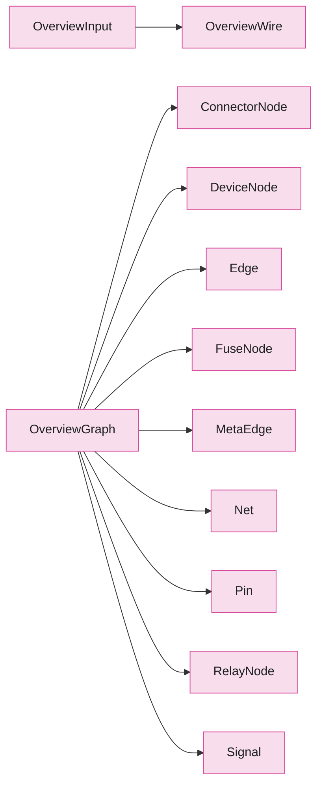

# Package `overview`

> Generated by `scripts/type_graph.py` from the live code. Do not edit; regenerate with `just type-graph`.

14 types.

## Structure inside the package

Fields, hub attributes and inheritance between this package's own types.

## Cross-package references

**Uses**

none

**Used by**

| Package | Types |
|---|---|
| `project` | `Project` |

## Types

### OverviewInput

`overview.inputs` - dataclass, frozen

Frozen snapshot of all connectivity produced by a built Project.

| Field | Type |
|---|---|
| `wires` | `tuple[OverviewWire, ...]` |
| `field_device_tags` | `frozenset[str]` |
| `terminal_tags` | `frozenset[str]` |
| `title` | `str` |
| `pcb_nets` | `tuple[tuple[str, str, tuple[str, ...]], ...]` |
| `fuse_links` | `tuple[tuple[str, str, str, str \| None], ...]` |
| `relay_contacts` | `tuple[tuple[str, str, str, str], ...]` |
| `relay_pins` | `dict` |

Used by: `OverviewGraph`, `Project`, `ValidationReport`

### OverviewWire

`overview.inputs` - dataclass, frozen

One normalised two-endpoint connection in the canonical pin_id vocabulary.

| Field | Type |
|---|---|
| `a` | `str` |
| `b` | `str` |
| `label` | `str \| None` |
| `kind` | `str` |

Used by: `OverviewInput`

### ProjectLike

`overview.inputs` - protocol

Structural type for objects that can produce an OverviewInput.

### ConnectorNode

`overview.model` - dataclass, frozen

A connector child-node nested inside a DeviceNode.

| Field | Type |
|---|---|
| `id` | `str` |
| `parent` | `str` |
| `device` | `str` |

Used by: `OverviewGraph`

### DeviceNode

`overview.model` - dataclass, frozen

A device compound node (board, terminal block, etc.).

| Field | Type |
|---|---|
| `id` | `str` |
| `device_class` | `str` |
| `string` | `int \| None` |
| `degree` | `int` |
| `x` | `float` |
| `y` | `float` |
| `anchor` | `float \| None` |

Used by: `OverviewGraph`

### Edge

`overview.model` - dataclass, frozen

A connection between two pins (harness, fuse, relay-contact, or PCB net).

| Field | Type |
|---|---|
| `id` | `str` |
| `kind` | `str` |
| `a` | `str` |
| `b` | `str` |
| `label` | `str \| None` |
| `net_class` | `str` |
| `directed` | `bool` |
| `signal_id` | `int \| None` |
| `meta_edge` | `str \| None` |
| `relay` | `str \| None` |
| `state` | `str \| None` |
| `signal_a` | `int \| None` |
| `signal_b` | `int \| None` |

Used by: `OverviewGraph`

### FuseNode

`overview.model` - dataclass, frozen

A fuse child-node nested inside a DeviceNode.

| Field | Type |
|---|---|
| `id` | `str` |
| `parent` | `str` |
| `board` | `str` |
| `pins` | `tuple[str, str]` |

Used by: `OverviewGraph`

### MetaEdge

`overview.model` - dataclass, frozen

Aggregated harness bundle between two devices.

| Field | Type |
|---|---|
| `id` | `str` |
| `a` | `str` |
| `b` | `str` |
| `net_count` | `int` |
| `classes` | `tuple[str, ...]` |
| `mixed` | `bool` |
| `net_class` | `str` |
| `wires` | `tuple[str, ...]` |

Used by: `OverviewGraph`

### Net

`overview.model` - dataclass, frozen

A PCB copper net rendered as a line, junction, or tag.

| Field | Type |
|---|---|
| `id` | `str` |
| `component` | `int` |
| `board` | `str` |
| `label` | `str` |
| `net_class` | `str` |
| `members` | `tuple[str, ...]` |
| `render` | `str` |
| `is_ground` | `bool` |

Used by: `OverviewGraph`

### OverviewGraph

`overview.model` - dataclass, frozen

Complete graph model for one overview page.

| Field | Type |
|---|---|
| `pins` | `tuple[Pin, ...]` |
| `edges` | `tuple[Edge, ...]` |
| `signals` | `tuple[Signal, ...]` |
| `devices` | `tuple[DeviceNode, ...]` |
| `connectors` | `tuple[ConnectorNode, ...]` |
| `relays` | `tuple[RelayNode, ...]` |
| `fuses` | `tuple[FuseNode, ...]` |
| `nets` | `tuple[Net, ...]` |
| `meta_edges` | `tuple[MetaEdge, ...]` |
| `max_visible_edge_budget` | `int` |

Used by: `ValidationReport`

### Pin

`overview.model` - dataclass, frozen

A physical connector pin with its signal assignment.

| Field | Type |
|---|---|
| `id` | `str` |
| `device` | `str` |
| `connector` | `str` |
| `pin` | `str` |
| `signal_id` | `int` |
| `device_class` | `str` |
| `parent` | `str` |
| `pin_role` | `str` |

Used by: `OverviewGraph`

### RelayNode

`overview.model` - dataclass, frozen

A relay compound node nested inside a DeviceNode.

| Field | Type |
|---|---|
| `id` | `str` |
| `parent` | `str` |
| `board` | `str` |
| `coil_pins` | `tuple[str, ...]` |
| `contact_pairs` | `tuple[tuple[str, str], ...]` |

Used by: `OverviewGraph`

### Signal

`overview.model` - dataclass, frozen

A group of electrically-connected pins sharing one net.

| Field | Type |
|---|---|
| `id` | `int` |
| `pins` | `tuple[str, ...]` |
| `labels` | `tuple[str, ...]` |
| `boards` | `tuple[str, ...]` |
| `net_class` | `str` |

Used by: `OverviewGraph`

### ValidationReport

`overview.validate` - dataclass, frozen

Result of a structural graph validation run.

| Field | Type |
|---|---|
| `ok` | `bool` |
| `problems` | `tuple[str, ...]` |
