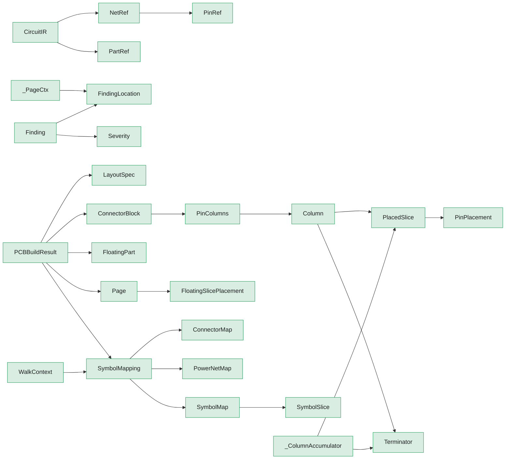

# Package `pcb`

> Generated by `scripts/type_graph.py` from the live code. Do not edit; regenerate with `just type-graph`.

30 types.

## Structure inside the package

Fields, hub attributes and inheritance between this package's own types.

## Cross-package references

**Uses**

| Package | Types |
|---|---|
| `core` | `Line`, `Point`, `Symbol`, `Text` |

**Used by**

| Package | Types |
|---|---|
| `core` | `Finding`, `Symbol` |
| `electrical` | `Circuit` |
| `project` | `Project` |

## Types

### CircuitIR

`pcb.adapter` - dataclass, frozen

Internal IR representation of a SKiDL Circuit.

| Field | Type |
|---|---|
| `parts` | `tuple[PartRef, ...]` |
| `nets` | `tuple[NetRef, ...]` |
| `nc_pins` | `tuple[tuple[str, str], ...]` |

### NetRef

`pcb.adapter` - dataclass, frozen

Reference to a net in the circuit.

| Field | Type |
|---|---|
| `name` | `str` |
| `pins` | `tuple[PinRef, ...]` |

Used by: `CircuitIR`

### PartRef

`pcb.adapter` - dataclass, frozen

Reference to a part in the circuit.

| Field | Type |
|---|---|
| `ref` | `str` |
| `template_name` | `str` |
| `pin_numbers` | `tuple[str, ...]` |
| `description` | `str \| None` |

Used by: `CircuitIR`

### PinRef

`pcb.adapter` - dataclass, frozen

Reference to a pin on a part within a net.

| Field | Type |
|---|---|
| `part_ref` | `str` |
| `pin_name` | `str` |

Used by: `NetRef`

### BomRow

`pcb.bom` - dataclass, frozen

One consolidated, supplier-annotated BOM row.

| Field | Type |
|---|---|
| `designators` | `tuple[str, ...]` |
| `footprint` | `str` |
| `quantity` | `int` |
| `designation` | `str` |
| `manufacturer` | `str` |
| `mfr_part_number` | `str` |
| `supplier` | `str` |
| `supplier_part_number` | `str` |
| `note` | `str` |

### PartLike

`pcb.bom` - protocol

Structural type for a placed PCB part: ref/value/footprint.

Used by: `BomRow`

### SupplierInfo

`pcb.bom` - dataclass, frozen

One footprint's sourcing data for the BOM.

| Field | Type |
|---|---|
| `manufacturer` | `str` |
| `mfr_part_number` | `str` |
| `supplier` | `str` |
| `supplier_part_number` | `str` |
| `note` | `str` |

Used by: `BomRow`

### _PageCtx

`pcb.checks.pcb016_overlap` - dataclass, mutable

Per-page data shared across all pair-check helpers.

| Field | Type |
|---|---|
| `page_title` | `str` |
| `loc` | `FindingLocation` |
| `outer_symbols` | `list[Symbol]` |
| `sym_bboxes` | `list[tuple[float, float, float, float]]` |
| `wires` | `list[Line]` |
| `texts` | `list[Text]` |
| `text_bboxes` | `list[tuple[float, float, float, float]]` |
| `nc_wire_indices` | `set[int]` |
| `port_positions` | `list[Point]` |

### NetKind

`pcb.classify` - enum

Classification of a net by pin count and power status.

| Member | Value |
|---|---|
| `DROPPED` | `'dropped'` |
| `CHAIN` | `'chain'` |
| `LABEL` | `'label'` |
| `POWER` | `'power'` |

### Finding

`pcb.findings` - dataclass, frozen

A single rule-linter finding from `review()`.

| Field | Type |
|---|---|
| `code` | `str` |
| `severity` | `Severity` |
| `message` | `str` |
| `location` | `FindingLocation` |

### FindingLocation

`pcb.findings` - dataclass, frozen

Where a Finding was raised. Any combination of fields may be present.

| Field | Type |
|---|---|
| `page_title` | `str \| None` |
| `connector_block_ref` | `str \| None` |
| `part_ref` | `str \| None` |
| `net_name` | `str \| None` |

Used by: `Finding`, `_PageCtx`

### Severity

`pcb.findings` - enum

Severity level for a Finding.

| Member | Value |
|---|---|
| `ERROR` | `'error'` |
| `WARNING` | `'warning'` |
| `INFO` | `'info'` |

Used by: `Finding`

### LayoutSpec

`pcb.layout_spec` - dataclass, frozen

Spacing and margin constants for connector-block layout.

| Field | Type |
|---|---|
| `pin_spacing_mm` | `float` |
| `side_padding_mm` | `float` |
| `block_height_mm` | `float` |
| `slice_height_mm` | `float` |
| `section_gap_mm` | `float` |
| `inter_block_gap_mm` | `float` |
| `horizontal_margin_mm` | `float` |
| `vertical_margin_mm` | `float` |
| `power_terminator_offset_mm` | `float` |
| `connector_to_first_label_gap_mm` | `float` |
| `connector_to_first_symbol_gap_mm` | `float` |
| `floating_top_label_gap_mm` | `float` |
| `wire_to_label_gap_mm` | `float` |
| `bottom_terminator_y_mm` | `float` |
| `row2_origin_y_offset_mm` | `float` |

Used by: `Circuit`, `ConnectorBlock`, `PCBBuildResult`, `Page`, `Symbol`

### Column

`pcb.model` - dataclass, frozen

Vertical stack of placed slices ending in a terminator.

| Field | Type |
|---|---|
| `slices` | `tuple[PlacedSlice, ...]` |
| `terminator` | `Terminator` |
| `terminator_label` | `str \| None` |
| `chain_net_name` | `str \| None` |

Used by: `PinColumns`

### ConnectorBlock

`pcb.model` - dataclass, frozen

One connector rendered as a unified anchor + per-pin column groups.

| Field | Type |
|---|---|
| `connector_ref` | `str` |
| `functional_label` | `str \| None` |
| `pin_columns` | `tuple[PinColumns, ...]` |
| `max_chain_height_mm` | `float` |
| `bottom_terminator` | `bool` |

Used by: `Circuit`, `PCBBuildResult`, `Page`

### ConnectorMap

`pcb.model` - dataclass, frozen

Marker dataclass: presence flags this template as a connector.

| Field | Type |
|---|---|
| `template` | `Any` |
| `bottom_terminator` | `bool` |

Used by: `SymbolMapping`

### FloatingPart

`pcb.model` - dataclass, frozen

A mapped part with at least one slice not reachable from any connector.

| Field | Type |
|---|---|
| `part_ref` | `str` |
| `slice_indices` | `tuple[int, ...]` |

Used by: `Circuit`, `ConnectorBlock`, `PCBBuildResult`, `Page`

### FloatingSlicePlacement

`pcb.model` - dataclass, frozen

One unowned slice placed inline on a connector page.

| Field | Type |
|---|---|
| `part_ref` | `str` |
| `slice_index` | `int` |
| `x_mm` | `float` |
| `y_mm` | `float` |

Used by: `Page`

### PCBBuildResult

`pcb.model` - dataclass, frozen

Frozen result of pcb.build().

| Field | Type |
|---|---|
| `state` | `Any` |
| `connector_blocks` | `tuple[ConnectorBlock, ...]` |
| `floating_parts` | `tuple[FloatingPart, ...]` |
| `pages` | `tuple[Page, ...]` |
| `mapping` | `SymbolMapping \| None` |
| `layout` | `LayoutSpec` |
| `max_symbols_per_column` | `int` |
| `page_size` | `tuple[float, float]` |
| `ir` | `Any` |

Used by: `Finding`, `Project`

### Page

`pcb.model` - dataclass, frozen

One rendered page.

| Field | Type |
|---|---|
| `title` | `str` |
| `placements` | `tuple[tuple[str, float, float], ...]` |
| `floating_part_refs` | `tuple[str, ...]` |
| `floating_placements` | `tuple[FloatingSlicePlacement, ...]` |

Used by: `PCBBuildResult`

### PinColumns

`pcb.model` - dataclass, frozen

All columns originating from one connector pin.

| Field | Type |
|---|---|
| `pin_id` | `str` |
| `columns` | `tuple[Column, ...]` |

Used by: `ConnectorBlock`

### PinPlacement

`pcb.model` - dataclass, frozen

Where a slice's pin sits within the column.

| Field | Type |
|---|---|
| `pin_id` | `str` |
| `port_name` | `str` |

Used by: `PlacedSlice`

### PlacedSlice

`pcb.model` - dataclass, frozen

One symbol slice placed in a column.

| Field | Type |
|---|---|
| `part_ref` | `str` |
| `slice_index` | `int` |
| `symbol` | `Symbol` |
| `pins` | `tuple[PinPlacement, ...]` |

Used by: `Column`, `_ColumnAccumulator`

### PowerNetMap

`pcb.model` - dataclass, frozen

SKiDL net name (canonical + aliases) → power symbol factory.

| Field | Type |
|---|---|
| `canonical_name` | `str` |
| `symbol` | `Callable[..., Symbol]` |
| `aliases` | `tuple[str, ...]` |

Used by: `NetKind`, `SymbolMapping`

### SymbolMap

`pcb.model` - dataclass, frozen

SKiDL template → tuple of SymbolSlices (1+ slices).

| Field | Type |
|---|---|
| `template` | `Any` |
| `slices` | `tuple[SymbolSlice, ...]` |

Used by: `SymbolMapping`

### SymbolMapping

`pcb.model` - dataclass, frozen

Full mapping config: SKiDL components → schematic symbols.

| Field | Type |
|---|---|
| `symbols` | `tuple[SymbolMap, ...]` |
| `connectors` | `tuple[ConnectorMap, ...]` |
| `power_nets` | `tuple[PowerNetMap, ...]` |

Used by: `Circuit`, `ConnectorBlock`, `Finding`, `FloatingPart`, `PCBBuildResult`, `Page`, `WalkContext`

### SymbolSlice

`pcb.model` - dataclass, frozen

A single symbol factory paired with a pin-to-port mapping (exactly 2 pins).

| Field | Type |
|---|---|
| `symbol` | `Callable[..., Symbol]` |
| `pin_map` | `Mapping[str, str]` |

Used by: `SymbolMap`

### Terminator

`pcb.model` - enum

How a column ends visually.

| Member | Value |
|---|---|
| `POWER` | `'power'` |
| `LABEL` | `'label'` |
| `NC` | `'nc'` |
| `CONTINUATION` | `'continuation'` |
| `PIN_AT_BOTTOM` | `'pin_at_bottom'` |

Used by: `Column`, `_ColumnAccumulator`

### WalkContext

`pcb.walk` - dataclass, mutable

Mutable state threaded through the walk algorithm.

| Field | Type |
|---|---|
| `ir` | `Any` |
| `mapping` | `SymbolMapping` |
| `slice_ownership` | `dict[tuple[str, int], str]` |
| `max_symbols_per_column` | `int` |
| `visited_nets` | `set[str]` |
| `placed_slices` | `set[tuple[str, int]]` |

Used by: `Column`

### _ColumnAccumulator

`pcb.walk` - dataclass, mutable

Mutable column being built during a walk.

| Field | Type |
|---|---|
| `slices` | `list[PlacedSlice]` |
| `terminator` | `Terminator` |
| `terminator_label` | `str \| None` |
| `chain_net_name` | `str \| None` |
