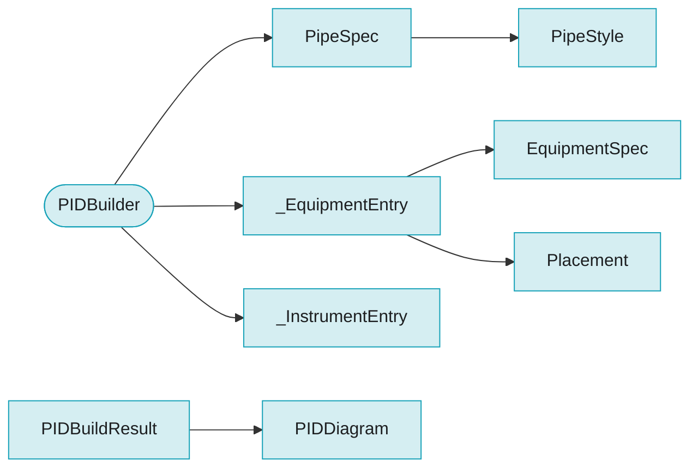

# Package `pid`

> Generated by `scripts/type_graph.py` from the live code. Do not edit; regenerate with `just type-graph`.

9 types.

## Structure inside the package

Fields, hub attributes and inheritance between this package's own types.

## Cross-package references

**Uses**

| Package | Types |
|---|---|
| `catalog` | `DeviceCatalog` |
| `core` | `Element`, `EquipmentConfig`, `EquipmentPlacement`, `GenerationState`, `Point`, `Symbol`, `Vector` |

**Used by**

| Package | Types |
|---|---|
| `core` | `Element`, `Symbol`, `ValidationResult` |
| `project` | `Project` |

## Types

### EquipmentSpec

`pid.builder` - dataclass, frozen

Specification for a piece of process equipment.

| Field | Type |
|---|---|
| `factory` | `SymbolFactory` |
| `tag_prefix` | `str` |
| `name` | `str` |
| `kwargs` | `dict[str, Any]` |

Used by: `_EquipmentEntry`

### PIDBuildResult

`pid.builder` - dataclass, frozen

Result of building a P&ID diagram.

| Field | Type |
|---|---|
| `state` | `GenerationState` |
| `diagram` | `PIDDiagram` |
| `equipment_map` | `dict[str, str]` |
| `instrument_map` | `dict[str, str]` |

Used by: `PIDBuilder`, `Project`

### PIDBuilder

`pid.builder` - hub

Fluent builder for P&ID diagrams.

| Uses | Kind | Via |
|---|---|---|
| `DeviceCatalog` | takes | `add_instrument_from_catalog` |
| `Point` | takes | `build` |
| `EquipmentConfig` | takes | `add_equipment` |
| `EquipmentPlacement` | takes | `add_equipment` |
| `GenerationState` | holds, takes | `__init__`, `_state`, `build` |
| `PIDBuildResult` | returns | `build` |
| `PipeSpec` | holds | `_pipes` |
| `_EquipmentEntry` | holds | `_entries` |
| `_InstrumentEntry` | holds | `_instruments` |
| `PipeStyle` | takes | `pipe` |

### PipeSpec

`pid.builder` - dataclass, frozen

A pipe connection between two pieces of equipment (or instruments).

| Field | Type |
|---|---|
| `from_equipment` | `str` |
| `from_port` | `str` |
| `to_equipment` | `str` |
| `to_port` | `str` |
| `line_spec` | `str` |
| `style` | `PipeStyle` |

Used by: `PIDBuilder`

### _EquipmentEntry

`pid.builder` - dataclass, mutable

Internal: all data associated with one piece of equipment.

| Field | Type |
|---|---|
| `spec` | `EquipmentSpec` |
| `placement` | `Placement \| None` |
| `abs_position` | `Point \| None` |

Used by: `PIDBuilder`

### _InstrumentEntry

`pid.builder` - dataclass, frozen

Internal specification for an ISA 5.1 instrument bubble.

| Field | Type |
|---|---|
| `letters` | `str` |
| `tag_prefix` | `str` |
| `on_equipment` | `str` |
| `on_port` | `str` |
| `location` | `str` |
| `offset` | `tuple[float, float]` |
| `fixed_tag` | `str \| None` |
| `kwargs` | `dict[str, Any]` |

Used by: `PIDBuilder`

### PipeStyle

`pid.connections` - dataclass, frozen

Visual style for a pipe or signal line.

| Field | Type |
|---|---|
| `stroke_width` | `float` |
| `dash_pattern` | `str \| None` |
| `color` | `str` |
| `show_flow_arrow` | `bool` |

Used by: `Element`, `PIDBuilder`, `PipeSpec`

### PIDDiagram

`pid.diagram` - dataclass, mutable

Mutable accumulator: equipment list + flat elements list (for the renderer).

| Field | Type |
|---|---|
| `equipment` | `list[Symbol]` |
| `elements` | `list[Element]` |

Used by: `PIDBuildResult`, `Symbol`, `ValidationResult`

### Placement

`pid.layout` - dataclass, frozen

Anchor + port pair + offset; `my_port` aligns to anchor's `anchor_port`.

| Field | Type |
|---|---|
| `anchor` | `str` |
| `anchor_port` | `str` |
| `my_port` | `str` |
| `offset` | `Vector` |

Used by: `Symbol`, `_EquipmentEntry`
