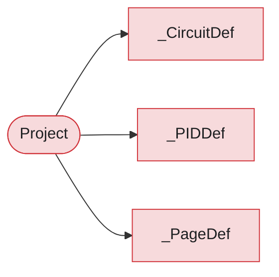

# Package `project`

> Generated by `scripts/type_graph.py` from the live code. Do not edit; regenerate with `just type-graph`.

4 types.

## Structure inside the package

Fields, hub attributes and inheritance between this package's own types.

## Cross-package references

**Uses**

| Package | Types |
|---|---|
| `catalog` | `DeviceCatalog`, `NetId`, `Wire` |
| `electrical` | `BuildResult`, `CompDescriptor`, `PartitionedElectricalResult`, `Plc`, `PlcAssignment`, `RefDescriptor`, `TermDescriptor`, `Terminal` |
| `overview` | `OverviewInput` |
| `pcb` | `PCBBuildResult` |
| `pid` | `PIDBuildResult` |

**Used by**

none

## Types

### Project

`project` - hub

Top-level mutable builder that assembles a complete multi-page schematic.

| Uses | Kind | Via |
|---|---|---|
| `NetId` | holds, takes | `_route_decls`, `_terminal_pair_decls`, `connect_terminals`, `route` |
| `DeviceCatalog` | holds, takes | `_catalog`, `set_catalog` |
| `Wire` | holds, takes | `_added_wires`, `_field_device_wires`, `add_wires` |
| `BuildResult` | holds | `_results` |
| `CompDescriptor` | takes | `circuit` |
| `RefDescriptor` | takes | `circuit` |
| `TermDescriptor` | takes | `circuit` |
| `Plc` | holds, takes | `_route_decls`, `route` |
| `PlcAssignment` | holds | `_plc_assignments` |
| `PartitionedElectricalResult` | takes | `add_partition` |
| `Terminal` | holds, takes | `_terminals`, `reserve_pins`, `terminals` |
| `OverviewInput` | returns | `overview_input` |
| `PCBBuildResult` | takes | `add_pcb` |
| `PIDBuildResult` | holds | `_pid_results` |
| `_CircuitDef` | holds | `_circuit_defs` |
| `_PIDDef` | holds | `_pid_defs` |
| `_PageDef` | holds | `_pages` |

### _CircuitDef

`project` - dataclass, mutable

Internal deferred circuit definition.

| Field | Type |
|---|---|
| `key` | `str` |
| `factory` | `str` |
| `params` | `dict[str, Any]` |
| `count` | `int` |
| `wire_labels` | `list[str] \| None` |
| `reuse_tags` | `dict[str, str] \| None` |
| `components` | `list[RefDescriptor \| CompDescriptor \| TermDescriptor] \| None` |
| `builder_fn` | `Callable \| None` |
| `start_indices` | `dict[str, int] \| None` |
| `terminal_start_indices` | `dict[str, int] \| None` |

Used by: `Project`

### _PIDDef

`project` - dataclass, mutable

Internal deferred P&ID diagram definition.

| Field | Type |
|---|---|
| `key` | `str` |
| `builder_or_factory` | `Any` |

Used by: `Project`

### _PageDef

`project` - dataclass, mutable

Internal page definition.

| Field | Type |
|---|---|
| `page_type` | `str` |
| `title` | `str` |
| `circuit_key` | `str` |
| `circuit_keys` | `list[str] \| None` |
| `md_path` | `str` |
| `notice` | `str \| None` |
| `csv_path` | `str` |
| `typst_content` | `str` |
| `cable_entries` | `list[tuple[str, str, str, str]] \| None` |
| `cable_toc_entries` | `list[tuple[str, str, str]] \| None` |

Used by: `Project`
