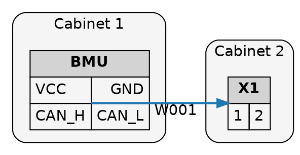

# Graphviz Reference

Distilled from the Graphviz docs, forum, and research. Aim: enough to
reason about *why* a layout came out the way it did, not just twiddle
parameters.

## Mental model: the dot algorithm

`dot` is a 4-pass hierarchical layout
(Gansner–Koutsofios–North–Vo, 1993):

1. **Rank assignment.** Network-simplex puts every node on a discrete
   integer rank such that all edges point in the rank-increasing
   direction and the sum of edge lengths is minimized. `rankdir=TB|LR|BT|RL`
   rotates the rank-increasing axis. `minlen` on an edge forces a
   minimum rank-difference.
2. **Virtual-node insertion.** Edges that span more than one rank get
   invisible dummy nodes on every intermediate rank. With
   `splines=ortho`, the route follows this dummy chain — that's why long
   edges zig-zag even when geometry would allow a straight line.
3. **Crossing reduction.** Within each rank, nodes reorder
   (median + transpose heuristic) to minimize edge crossings.
   `ordering="in"|"out"` constrains this to follow input order.
4. **Coordinate assignment + spline routing.** `nodesep` (default 0.25
   in) and `ranksep` (default 0.5 in) set spacing. Edges routed last as
   splines/polylines according to `splines`.

**Clusters are hard layout constraints, not containers.** Every node in
`cluster_X` must end up inside one bounding rectangle, which can fight
rank assignment. Layout time and crossing count grow noticeably with
deep nesting; we have no specific upstream-documented threshold, so
treat any nesting beyond a few levels as a place to measure rather than
assume.

**`compound=true`** is required for `lhead`/`ltail` to actually clip
cross-cluster edges; without it those attributes are silently ignored.

**Two ways to declare a cluster.** A subgraph whose name starts with
the literal `cluster` (e.g. `cluster_cabinet1`) is treated as a
cluster. Modern Graphviz also honors a `cluster=true` attribute on any
subgraph regardless of name. The name-prefix form is more widely
compatible with older toolchains; the attribute form is cleaner when
ids are generated programmatically.

## HTML-table node labels with ports

We use these for pin-level edge attachment. (See
[`07-open-questions.md`](07-open-questions.md) on whether HTML-table
labels stay in v0 or get swapped for `record` shape.)

```dot
BMU [shape=plaintext, label=<
  <TABLE BORDER="0" CELLBORDER="1" CELLSPACING="0" CELLPADDING="4">
    <TR><TD COLSPAN="2" BGCOLOR="lightgrey">BMU</TD></TR>
    <TR><TD PORT="VCC" ALIGN="LEFT">VCC</TD>
        <TD PORT="GND" ALIGN="RIGHT">GND</TD></TR>
    <TR><TD PORT="CAN_H">CAN_H</TD>
        <TD PORT="CAN_L">CAN_L</TD></TR>
  </TABLE>>];
```

- `shape=plaintext` (or `shape=none`; modern Graphviz also recognises
  `shape=plain` as a shorthand) so the outer node shape doesn't draw a
  redundant border.
- Edge endpoints reference `node:port:compass` where compass is
  `n|ne|e|se|s|sw|w|nw|c|_`.
- **Always set compass points** (`:e`, `:w`) when using `splines=ortho`.
  Without them you get diagonal stubs everywhere.
- Stylable inside cells: `BGCOLOR`, `BORDER`, `CELLBORDER`,
  `CELLPADDING`, `CELLSPACING`, `ALIGN`, `VALIGN`, `COLSPAN`,
  `ROWSPAN`, `WIDTH`, `HEIGHT`, `<FONT>` wrappers.
- Not available: arbitrary CSS, rounded cells, gradients, rotated text,
  non-rectangular cells.
- We do **not** use `URL`/`HREF` (no hyperlinks per design — see
  [`01-vision-and-scope.md`](01-vision-and-scope.md)).

Alternative: `record` shape (`label="<f0> VCC | <f1> GND"`) supports
ports too but is less flexible (no per-cell colors, no multi-row
cells, no per-cell alignment). v0 default is HTML-table; switch to
record only if HTML labels prove problematic.

## Cluster-as-endpoint workaround

**Cluster ports do not exist.** A cluster cannot be the source/target
of an edge directly. Workaround when needed:

1. `compound=true` on the root.
2. Place a real node inside the cluster (in our case, the cabinet's
   terminal block — that *is* the boundary anyway).
3. `lhead=cluster_X` / `ltail=cluster_Y` on the edge to clip it to the
   cluster wall.

For our case the workaround is mostly unnecessary: terminal blocks are
real nodes that *are* the cabinet boundary. Modeling them as nodes is
honest, not a hack.

## `splines="ortho"` reality

- Official docs: "does not handle ports or, in dot, edge labels." In
  practice ports + ortho works in most cases; edge labels along the
  edge don't.
- **Don't combine with `concentrate=true`** — documented unresolved
  segfault when ortho + concentrate + edge label (Graphviz issue
  #2183, still open at last check, reproducible against ≥ 2.50).
- **Edge labels:** use `xlabel="..."` instead of `label="..."` on the
  edge. `forcelabels` defaults to `true`, so writing `forcelabels=true`
  is harmless but redundant — only set it if you've previously
  disabled it.
- **Diagonal stubs** at port attachment: documented and acceptable per
  R&D goals. Set compass points to minimize them.
- `splines` set on a subgraph is ignored. It must go on the **root**
  graph.

## Edge labels and crowding

With many wires, options in increasing aggression:

1. No label, color-code by `kind`. **Default for Overview.**
2. `xlabel` + `forcelabels=true` for selective labels (e.g.
   boundary-crossing wires only).
3. `headlabel` / `taillabel` anchored at endpoints.

Avoid `concentrate=true` — merges parallel edges, the opposite of what
R&D wants.

## SVG output specifics

- `dot -Tsvg` emits hand-written SVG, structured as
  `<g class="node">`, `<g class="edge">`, `<g class="cluster">`, with
  `<title>` text holding the DOT identifier.
- This stable structure is what makes the validator's SVG-parse checks
  tractable (see [`06-feedback-loop.md`](06-feedback-loop.md)).
- **Use `-Tsvg` (default), not `-Tsvg:cairo`.** The Cairo-based SVG
  exporter produces a path-based, less structurally stable SVG that
  drops or re-orders the class hierarchy the validator relies on. The
  Python `graphviz` package's `format='svg'` maps to plain `-Tsvg` by
  default; do not pass an alternative renderer.
- We do **not** add `URL`/`HREF`/`target` attributes — pure-SVG output,
  no hyperlinks.

## Determinism

`dot` is byte-stable for fixed binary version + identical input order.
Two threats to reproducibility:

1. **Python dict iteration** can reorder nodes/edges. **Always sort by
   stable key (id) before emitting.**
2. **Graphviz binary version drift.** Pin the version in CI; minor
   releases shift layouts.

For diff-based regression detection, normalize the SVG: strip the
`<!-- Generated by graphviz ... -->` comment and any per-run id
counters before comparing.

## Python `graphviz` package

- Mostly a string builder + `subprocess.run(['dot', ...])` wrapper.
- Useful: `Digraph()`, `.node()`, `.edge()`, `.subgraph()`, `.source`
  (get DOT before render), `.render(format='svg')`.
- `graphviz.escape()` for non-HTML labels;
  `graphviz.nohtml()` for strings literally starting with `<`.
- HTML labels: a string is treated as HTML iff it starts with `<` and
  ends with `>` (no leading whitespace). The `<<TABLE>...</TABLE>>`
  double-bracket pattern: outer `<...>` is the DOT "this is HTML"
  marker, inner `<TABLE>` is the actual HTML.
- **Not** declared directly in `Schematika/pyproject.toml` today — it
  resolves transitively via SKiDL. Add as a direct dep when Overview
  ships.
- The `dot` binary is a separate concern; must be on `PATH`.

## Pitfalls (top)

1. Subgraph not named `cluster_*` (and missing `cluster=true` on the
   subgraph) → silent no-op, no box drawn.
2. Forgetting `compound=true` → `lhead`/`ltail` ignored silently.
3. HTML label with leading/trailing whitespace → treated as plain text.
4. Unescaped `&`/`<`/`>` in port names or table text → `dot` parse
   error at render time.
5. Port names colliding with DOT keywords (`node`, `edge`, `graph`,
   `digraph`, `subgraph`, `strict`) → quote them or prefix.
6. `splines=ortho` + `concentrate=true` + edge label → unresolved
   segfault (issue #2183).
7. Missing compass points on ortho edges → diagonal stubs.
8. Unsorted Python dict iteration → "random" layout diffs.
9. Deep cluster nesting → poor layouts and noticeably slower runtimes.
   Measure rather than assume a level cap.
10. `fontname` defaulting to `Times-Roman` (often missing on Linux) →
    silent layout shift. Set `fontname="Helvetica"` explicitly at graph
    level.
11. Port names with colons or dots (`PLC:AI:Sig`) — quote them, since
    `:` is the port-separator character in edge endpoints.
12. `bgcolor` on a cluster only paints when `style` includes `filled`.
    Use `style="rounded,filled"; fillcolor="#f5f5f5"` (or `bgcolor`
    with `style="rounded,filled"`); a bare `style=rounded` leaves the
    cluster unfilled.
13. `splines` on a subgraph is silently ignored — must go on the root.
14. Using `-Tsvg:cairo` breaks the validator's class-name parsing.
    Stick to plain `-Tsvg`.
15. Trapezoid-table overflow on very dense ortho-routed graphs (issue
    #1880). Routes silently truncate when many parallel edges share a
    narrow channel.

## Layout-tuning checklist (in order)

1. Sort the input. Most "random ugliness" is unsorted insertion order.
2. Set `rankdir`: wide → `LR`, tall → `TB`. Don't mix mid-graph.
3. Confirm `splines="ortho"` is on the **root** graph (cluster-level
   `splines` is ignored).
4. Add compass points to all edge endpoints.
5. Bump `ranksep` then `nodesep` if too cramped.
6. Remove a level of cluster nesting if cross-cluster edges cross
   wildly.
7. `ordering="out"` on the root if edge order within a node matters.
8. Reorder ports in the HTML table to put commonly-connected ports
   adjacent.
9. Switch to `splines="polyline"` temporarily to debug whether ortho is
   the cause of a specific bad routing.

## Worked DOT example

Two cabinets, one cross-cluster edge, HTML-table ports, ortho. No
hyperlinks.



## Sources

- [dot layout algorithm — Graphviz](https://graphviz.org/docs/layouts/dot/)
- [HTML-like labels — Graphviz](https://graphviz.org/doc/info/shapes.html)
- [splines attribute — Graphviz](https://graphviz.org/docs/attrs/splines/)
- [SVG output — Graphviz](https://graphviz.org/docs/outputs/svg/)
- Graphviz forum threads on ortho routing limitations and the cluster-port workaround.
